class: middle, center

### 大数据时代下人工智能技术的应用与创新

# 机器学习算法

陈一帅

[yschen@bjtu.edu.cn](mailto:yschen@bjtu.edu.cn)

.footnote[北京交通大学网络智能实验室]
---
# 内容
- 算法
- 模型
- 性能
---
# 内容
- .red[算法]
- 模型
- 性能
---
# 算法
- 有监督
- 无监督
---
# 有监督和无监督
- 有监督：已知正确答案，比如图片类别
- 无监督：没有正确答案，比如只有图片

.center[.width-100[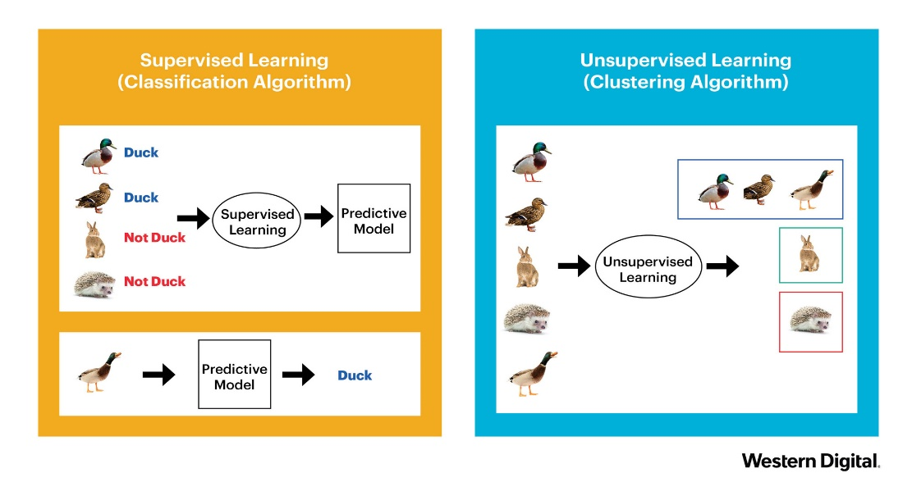]]
---
class: middle, center

# 1）有监督学习

Supervised learning

已知正确答案
---
# 步骤
1. 打标
2. 训练
3. 测试
---
# 1）打标

1. 收集数据集
2. 打标
  * 给图片标注：“猫”，“狗”
3. 把数据分为三部分
    * 训练集：训练模型
    * 验证集：选择模型参数
    * 测试集：测试模型准确度
---
# 2）训练模型

1. 训练：训练模型
2. 验证：选择模型参数
3. 测试：在测试集上，对模型进行最终的评估

 
<!-- .center[.width-100[]] -->
<!-- .center[.width-100[]] -->
.center[.width-100[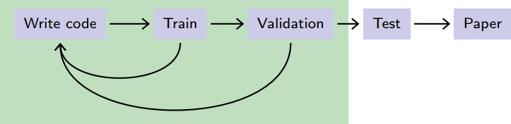]]
---
class: middle, center

# 2）无监督学习

Unsupervised learning

有数据，无标签，就在数据上寻找规律
---
# 1）聚类

指定聚为3个簇

.center[.width-100[]]
---
# 1）聚类

- 聚完类后，观察各簇，获得其物理意义
- 结果可能是这样的

.center[.width-100[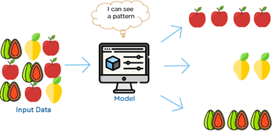]]
---
# 1）聚类

- 结果也可能是这样的

 
.center[.width-100[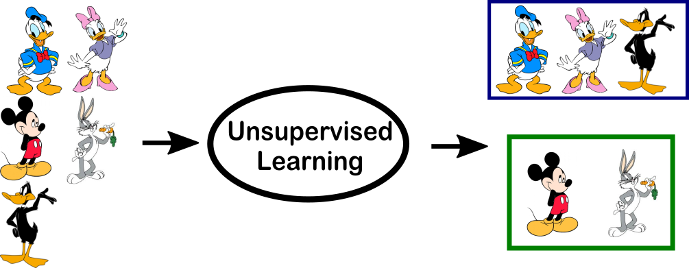]]
---
# 2）异常检测

发现离群的点，即异常点

.center[.width-100[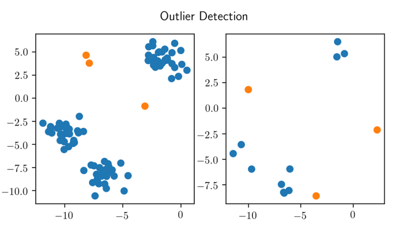]]

---
# 小结：学习类型

1. 有监督学习
  - 已知正确答案（标签）
1. 无监督学习
  - 从纯数据中发现规律

---
# 内容
- 算法
- .red[模型]
- 性能

---
class: middle, center
# 模型训练方法
在错误中学习

???
* 涉及到一点代数和向量的知识
* 简单的例子：
  * 把一个直角坐标系里画满数据的坐标，然后在上面放上一个指针，这个指针的位置是会根据数据的对或者错更改位置的，这也是人工智能的本质。
---
# 大脑学习过程
* 根据实验结果，不断创建、强化、弱化神经元之间连接
* 也就是调整连接的权重：$w$

.center[.width-80[]]
---
# 机器学习的学习过程
- 出现错误，调整模型参数
 
 
 
.center[.width-100[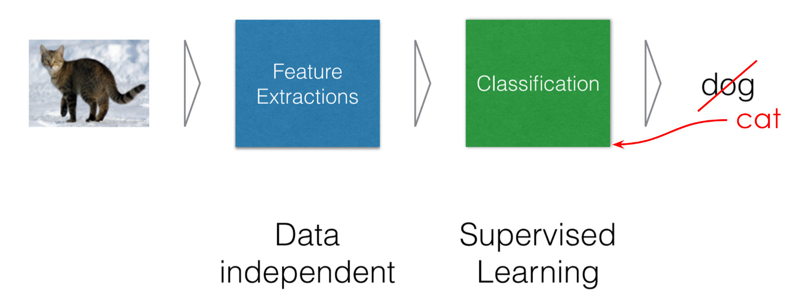]]
---
# 感知机的学习过程
- 发现错误，调整$w$，调整决策边界

.center[.width-100[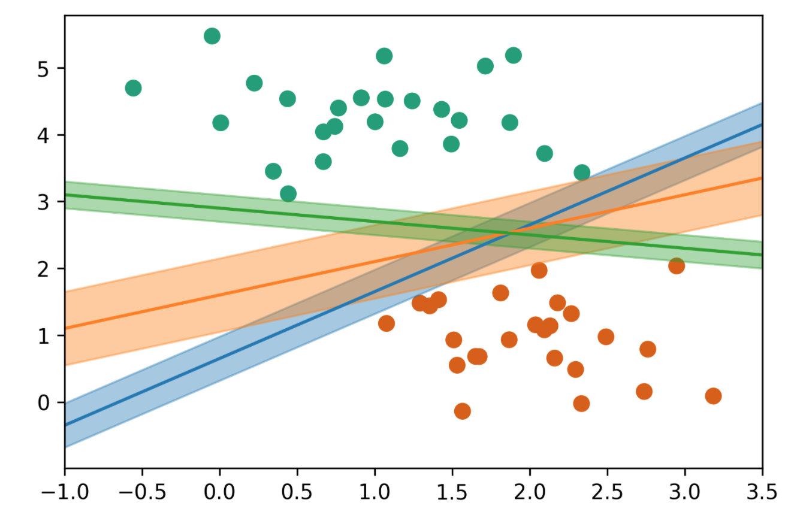]]
<!-- .center[.width-100[]] -->

---
class: middle, center
# 深度学习
Deep Learning
---
# 机器学习

- 先提取图片特征
- 然后根据这些特征进行学习

.center[.width-100[]]
---
# 深度学习
- 不专门提取数据特征
- 将原始数据直接送入多层神经元网络进行学习
- 出现错误，调整到底

.center[.width-100[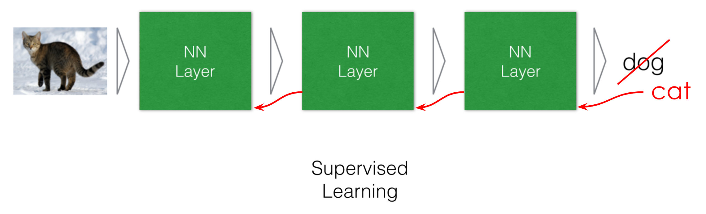]]
---
class: middle, center
# 常用结构
FFN、CNN
---
class: middle, center
# 前向神经元网络
FFN：Feed Forward Network
---
# 前向神经元网络
输入层，隐藏层，输出层

.center[.width-80[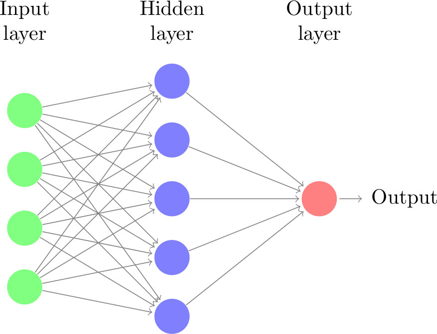]]
---
# 深度神经元网络
 
.center[.width-100[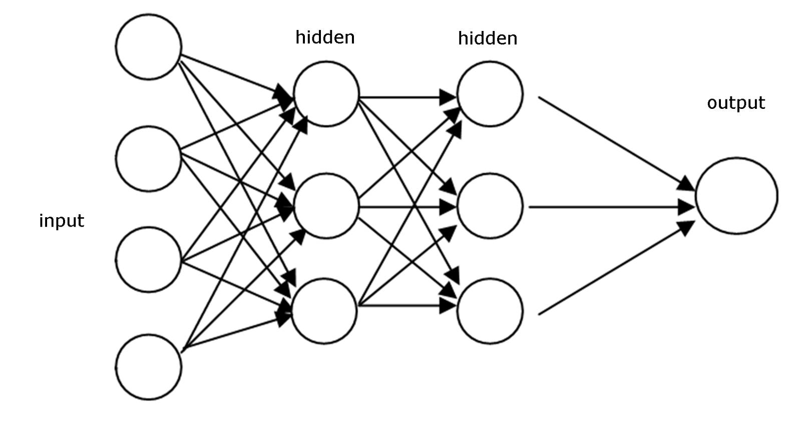]]
.center[多个隐藏层]
---
# 深度的好处
越深，模型能力越强
 
 
.center[.width-100[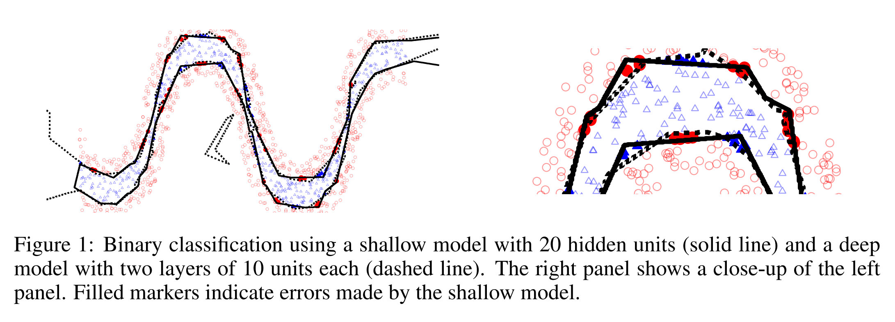]]
---
# FNN练习
- 基于浏览器的TensorFlow实验平台
- http://playground.tensorflow.org

.center[.width-90[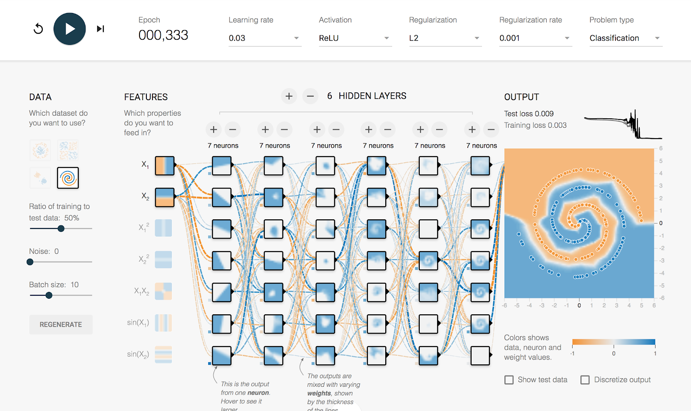]]
---
class: middle, center
# 卷积神经元网络
CNN：Convolutional Neural Network
---
# 卷积神经元网络
* 一种特别的多层前向神经元网络
* 起源：手写体识别
* 常用于图像视觉应用、文本处理

.center[.width-80[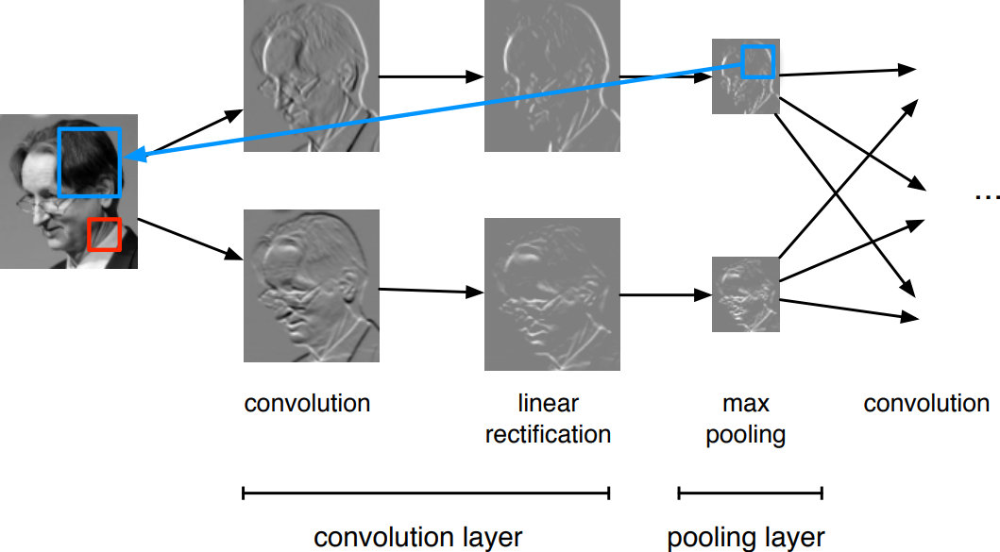]]
---
# 组成
- 卷积层
  * 卷积 + 非线性激活函数（如ReLU）
- 池化层

.center[.width-90[]]
---
# 复习：卷积操作
二维卷积，对应位置相乘，然后相加

.center[.width-100[]]
---
# 复习：图像卷积
滤波器在图片上滑动，进行卷积操作
.center[.width-100[]]
---
# 复习：图像卷积效果
选择合适卷积核（滤波器），卷积计算图像像素梯度

.center[.width-100[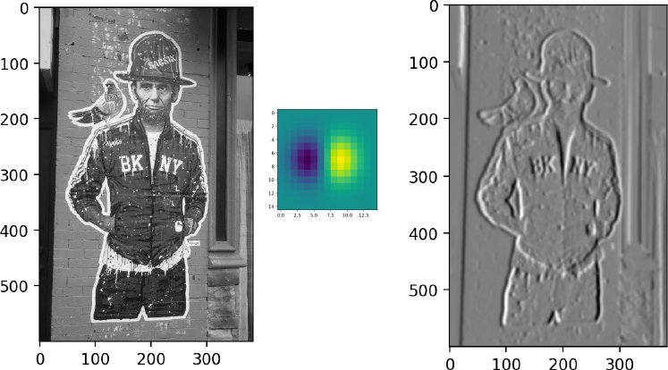]]
---
# 深度卷积神经元网络
- 将原始数据直接送入多层神经元网络进行学习
- 多次卷积池化
- 出现错误，一路调整卷积核

 
.center[.width-100[]]
---
# 池化
采样降低数据量

 
.center[.width-100[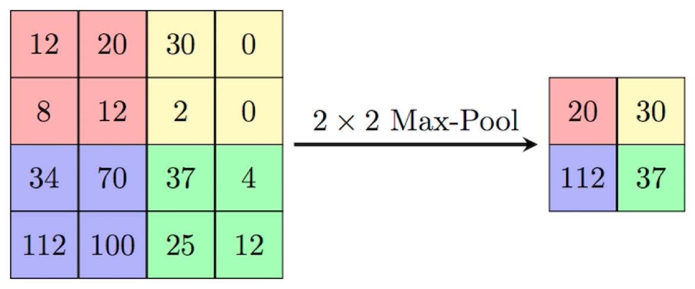]]
 
.center[最大池化：Max Pooling]
---
# LeNet
- 手写体识别
- 1988年，LeCun

 
.center[.width-100[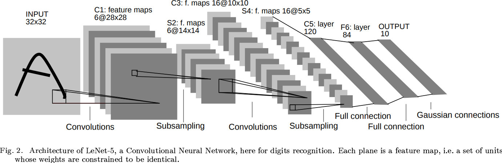]]
---
# 图像处理效果
经过第一层卷积和池化

.center[.width-100[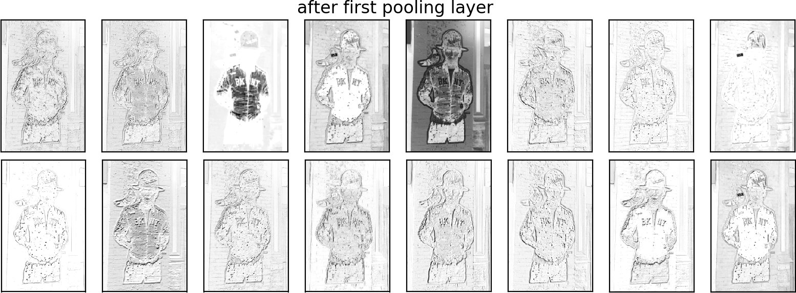]]
---
# 图像处理效果
经过第二层卷积和池化

.center[.width-100[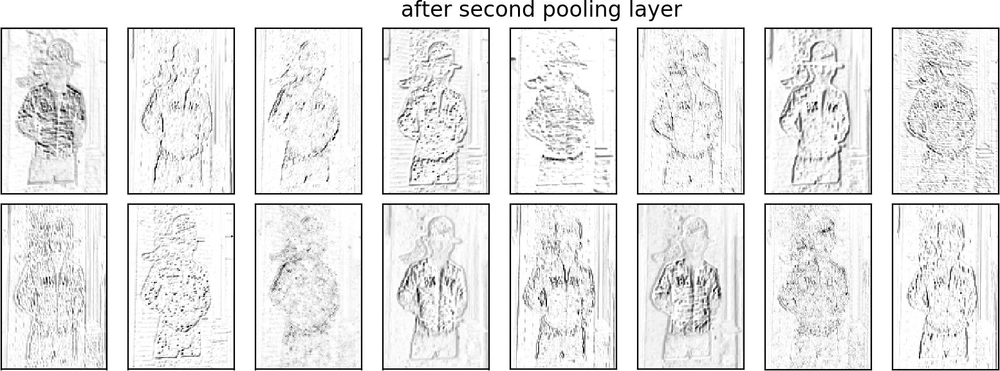]]
---
# 深度CNN
实际应用的模型层次非常多

 
.center[.width-100[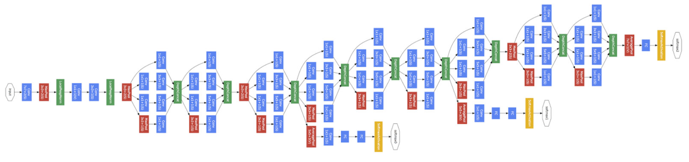]]
 
.center[GoogleNet]
---
# GPU
- 几千万像素、上千万参数需要计算、调整
- 利用GPU的数千计算单元并行计算
<!-- .center[.width-100[]] -->

.center[.width-60[]]
---
# 深度带来性能极大改善

ImageNet目标识别图像数据集

.center[.width-100[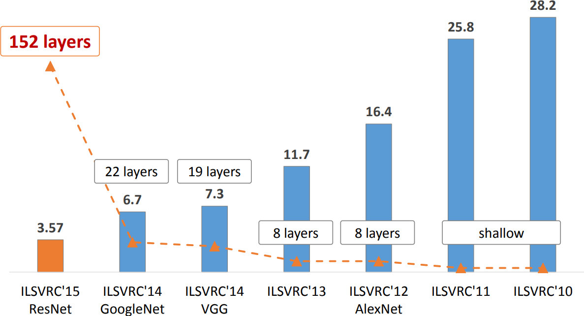]]
---
# 对各层卷积核的理解
- 底层提取简单特征，高层提取复杂特征

.center[.width-100[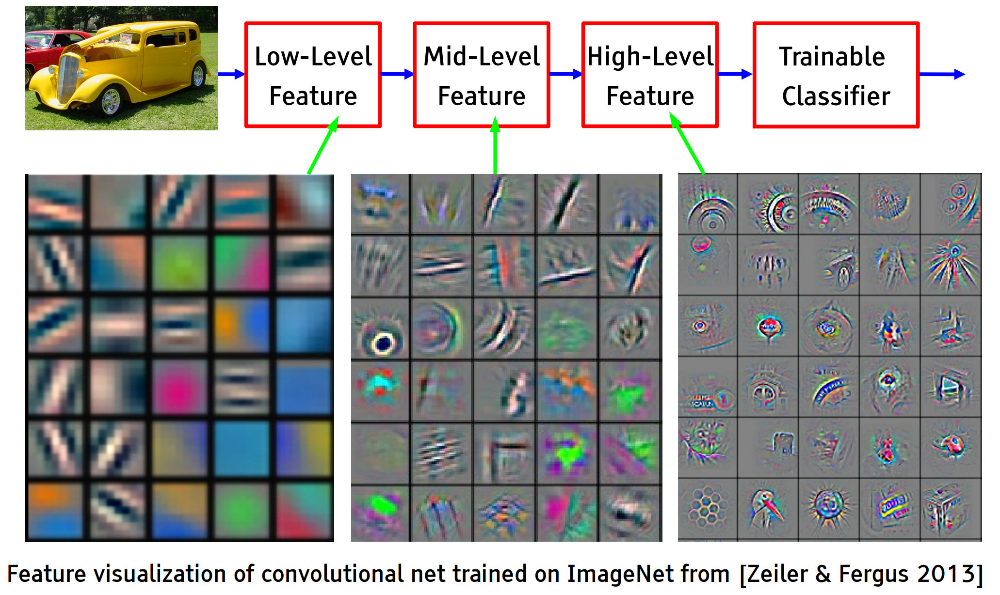]]
---
# CNN演示
- Andrej Karpathy ConvNetJS
- https://cs.stanford.edu/people/karpathy/convnetjs/demo/mnist.html
- 在浏览器里训练CNN，实验MNIST手写体识别任务

---
# 内容
- 算法
- 模型
- .red[性能]

---
# 性能
- 数据
- 模型

---
class: middle, center
# 1）数据
好的数据是成功的关键
---
# 数据量对结果的影响
数据量少，模型误差大
.center[.width-100[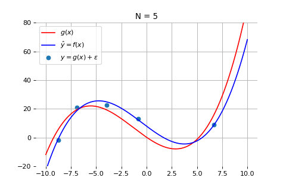]]
---
# 数据量对结果的影响
随着数据量增长，模型误差减少
.center[.width-100[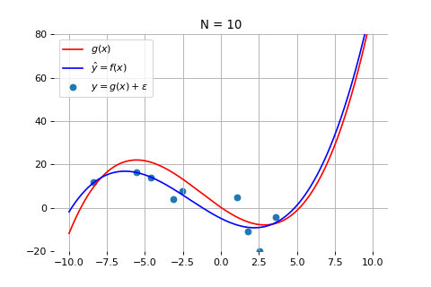]]
---
# 数据量对结果的影响
随着数据量增长，模型误差减少
.center[.width-100[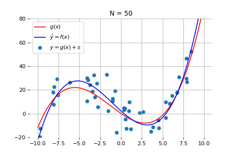]]
---
# 数据量对结果的影响
随着数据量增长，模型误差减少
.center[.width-100[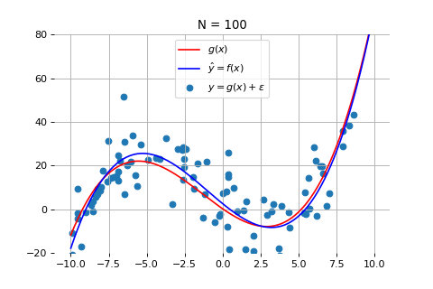]]
---
# 数据量对结果的影响
随着数据量增长，模型误差减少
.center[.width-100[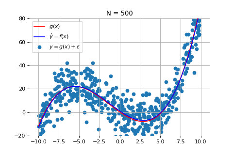]]
---
# 数据量对结果的影响
随着数据量增长，模型误差减少
.center[.width-100[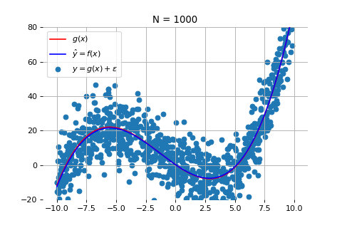]]
---
class: middle, center
# 2）模型

模型选择非常重要
---
# 模型能力
模型能力不够，欠拟合
.center[.width-100[]]
---
# 模型能力
模型能力不够，欠拟合
.center[.width-100[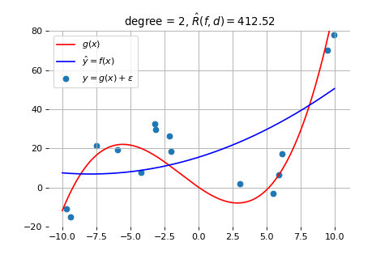]]
---
# 模型能力
模型能力适中
.center[.width-100[]]
---
# 模型能力
模型能力适中
.center[.width-100[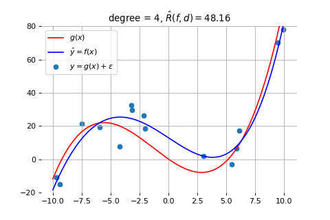]]
---
# 模型能力
模型能力适中
.center[.width-100[]]
---
# 模型能力
模型能力太强，过拟合
.center[.width-100[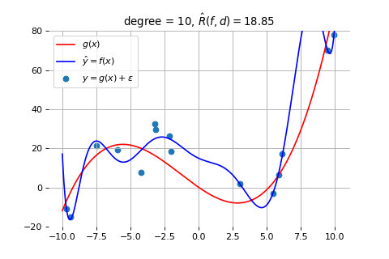]]
---
# 模型能力
- 训练集上，模型错误随模型能力增长一直下降
- 但最后的下降，是过拟合了
.center[.width-90[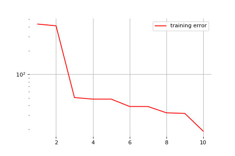]]
---
# 过拟合
- 过拟合导致模型在测试集上错误上升
.center[.width-100[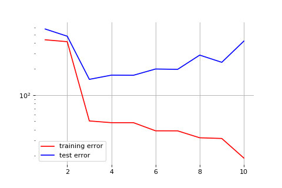]]
---
# 模型能力
选择合适的模型非常重要

.center[.width-100[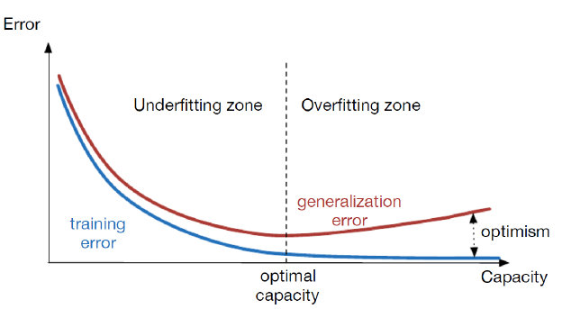]]
---
# 模型选择

* 深度神经网络不是唯一的机器学习算法
* 完全可以基于干净的数据集、更简单的算法（如线性回归）来解决问题
* 记住奥卡姆剃刀准则
---
class: middle, center

# 奥卡姆剃刀准则

简约至上

“The explanation requiring the fewest assumptions is most likely to be correct”

"解释能力相同情况下，假设越少越好”
---
# 奥卡姆剃刀

- Occam’s Razor
- 14世纪逻辑学家，奥卡姆的威廉（William of Occam）提出
- “切勿浪费较多东西，去做‘用较少的东西，同样可以做好的事情’
---
# 奥卡姆剃刀

- 关于同一个问题有许多种理论，每一种都能作出同样准确的预言，那么挑选其中使用假定最少的
- 尽管越复杂的方法通常能做出越好的预言，但是在不考虑预言能力（即结果大致相同）的情况下，假设越少越好
- 在结果大致相同的情况下，模型越简单越好

???
简约之法则，是由14世纪逻辑学家、圣方济各会修士奥卡姆的威廉（William of Occam，约1287年至1347年，奥卡姆（Ockham）位于英格兰的萨里郡）提出的一个解决问题的法则，他在《箴言书注》2卷15题说“切勿浪费较多东西，去做‘用较少的东西，同样可以做好的事情’。”换一种说法，如果关于同一个问题有许多种理论，每一种都能作出同样准确的预言，那么应该挑选其中使用假定最少的。尽管越复杂的方法通常能做出越好的预言，但是在不考虑预言能力（即结果大致相同）的情况下，假设越少越好。

---
# 小结
- 算法
  - 有监督、无监督
- 模型
  - 机器学习、深度学习
  - 前向神经元网络、卷积神经元网络
- 性能
  - 数据、模型

---
# 复习题I
- 什么是有监督学习？什么是无监督学习？
- 图片分类是有监督学习，还是无监督学习？
- 聚类是有监督学习，还是无监督学习？
- 两种最典型的深度神经元网络，分别是什么？
- 模型的能力不够，会过拟合还是欠拟合？
- 模型的能力太强，会过拟合还是欠拟合？
- 什么是奥卡姆剃刀原则？