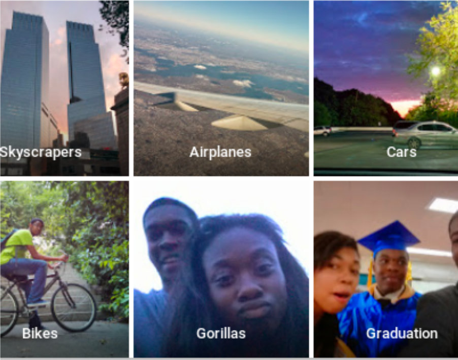

class: middle, center

### AI技术和云技术在视频监控中的应用

# AI视频监控

陈一帅

[yschen@bjtu.edu.cn](mailto:yschen@bjtu.edu.cn)

北京交通大学电子信息工程学院

.footnote[铁路综合视频监控维护管理培训班]

---
# 内容
- .red[背景]
- 目标检测和识别
- 图像分割
- 应用
- 应注意的问题
---
# 基本研究问题
目标检测、分割、识别

.center[.width-100[]]
---
class: middle, center
# 困难
遮蔽、干扰、噪声
---
# 拖把狗
.center[.width-80[]]
---
# 蛋糕狗
.center[.width-80[]]
---
# 云雾
.center[.width-100[]]
---
# 内容
- 背景
- .red[目标检测和识别]
- 图像分割
- 应用
- 应注意的问题
---
# 图像
.center[.width-100[]]
---
# 目标检测与识别
.center[.width-100[]]
---
# 目标检测与识别

.center[.width-70[]]

---
# 深度学习方法
- 2012年，AlexNet
- 双阶段检测器
  - 先找区域，再识别目标
  - RCNN、Pyramid Networks
- 单阶段检测器
  - 不找区域，直接识别目标
  - YOLO、SSD、Retina-Net
- 评估mAP
  - VOC 83% （2018），COCO（69% 2019）
---
# RetinaNet效果

.center[.width-80[]]

???
https://towardsdatascience.com/review-retinanet-focal-loss-object-detection-38fba6afabe4
---
# 性能
.center[.width-100[]]
---
<!-- # 性能 -->
.center[.width-70[]]
---
# 内容
- 背景
- 目标检测和识别
- .red[图像分割]
- 应用
- 应注意的问题
---
class: middle, center
# 图像分割
Object Segmentation

从图形中提取对象的轮廓
---
# 图像分割

.center[.width-100[]]
---
# 语义分割
Semantic Segmentation

 
.center[.width-100[]]
---
# 实例分割
Instance Segmentation

 
.center[.width-100[]]
---
# 实例分割

.center[.width-90[]]
---
# 实例分割

 
.center[.width-100[]]
---
# 实例分割

 
.center[.width-100[]]
---
class: middle, center
# 语义分割（2017）
<!-- <video width="700" controls>
    <source src="./video/seg.mp4" type="video/mp4">
</video> -->

  <iframe src="//player.bilibili.com/player.html?aid=54907833&cid=96023749&page=1" scrolling="no" border="0" frameborder="no" framespacing="0" allowfullscreen="true"> </iframe>

---
# 实例分割
分类每个像素，得到Mask

.center[.width-100[]]
---
# Mask RCNN
- 2017年，基于FPN（金字塔网络）和ResNet

.center[.width-100[]]
---
# Mask RCNN效果
<!-- .center[.width-100[]] -->
.center[.width-100[]]
---
# Mask RCNN效果
.center[.width-100[]]
---
# 内容
- 背景
- 目标检测和识别
- 图像分割
- .red[应用]
- 应注意的问题
---
class: center, middle

# 应用
---
# 颜色气球追踪
.center[.width-80[]]
---
# 细胞核分割
.center[.width-100[]]
---
# 工业机器人
.center[.width-100[]]
---
# 3D建筑物
.center[.width-100[]]
---
# 细胞游动
.center[.width-80[]]
---
# 地理多边形
.center[.width-80[]]
---
# 照片特效
.center[.width-100[]]

???
https://github.com/matterport/Mask_RCNN
---
# 人脸检测
.center[.width-90[]]
---
# 人脸识别
- 美国马里兰州枪击事件，人脸识别技术找出了嫌犯
- 流行歌星泰勒·斯威夫特，演唱会上过滤狂热粉丝和跟踪狂
- 收容所追踪收容所和避难所的使用情况
---
# 姿势检测与识别

.center[.width-100[]]
---
# 姿势检测与识别

.center[.width-100[]]
---
# 情感

.center[.width-100[]]
---
class: middle, center
# 交通流量计数

<!-- <video width="700" controls>
    <source src="./video/traffic-count.mp4" type="video/mp4">
</video> -->

  <iframe src="//player.bilibili.com/player.html?aid=54907357&cid=96026074&page=1" scrolling="no" border="0" frameborder="no" framespacing="0" allowfullscreen="true"> </iframe>

---
class: middle, center
# 交通流量计数

<!-- <video width="700" controls>
    <source src="./video/traffic-count2.mp4" type="video/mp4">
</video> -->

  <iframe src="//player.bilibili.com/player.html?aid=54907492&cid=96024461&page=1" scrolling="no" border="0" frameborder="no" framespacing="0" allowfullscreen="true"> </iframe>

---
# 交通信号识别

.center[.width-90[]]
---
class: middle, center
# 铁轨检测
<!-- <video width="700" controls>
    <source src="./video/railway.mp4" type="video/mp4">
</video> -->

  <iframe src="//player.bilibili.com/player.html?aid=54907949&cid=96020491&page=1" scrolling="no" border="0" frameborder="no" framespacing="0" allowfullscreen="true"> </iframe>

---
class: middle, center
# 道口监控
<!-- <video width="700" controls>
    <source src="./video/crossing.mp4" type="video/mp4">
</video> -->

  <iframe src="//player.bilibili.com/player.html?aid=54907949&cid=96020491&page=1" scrolling="no" border="0" frameborder="no" framespacing="0" allowfullscreen="true"> </iframe>

---
# 文本识别
.center[.width-100[]]
---
# 清晰度增强
.center[.width-100[]]
---
# 去噪

.center[.width-80[]]
---
# 图像转换
- 图像还原、渲染、着色
- 地图提取、场景转换

 
.center[.width-100[]]
---
# 图像理解

图像 - 问答 - 文本描述

.center[.width-100[]]
---
class: middle,center
# 实时图像理解（2015）
<!-- <video width="700" controls>
    <source src="./video/caption.mp4" type="video/mp4">
</video> -->

  <iframe src="//player.bilibili.com/player.html?aid=54906321&cid=96021881&page=1" scrolling="no" border="0" frameborder="no" framespacing="0" allowfullscreen="true"> </iframe>

<!-- .center[.width-100[]] -->
<!-- .center[.width-100[]] -->

---
# 内容
- 背景
- 目标检测和识别
- 图像分割
- 应用
- .red[应注意的问题]
---
# 应注意的问题
- 准确率
- 隐私保护
- 公平
---
# 准确率问题
- 2018年7月，“美国公民自由联盟”测试了亚马逊的人脸识别系统
- 将535名国会议员面孔，对照25000张公开的警方嫌疑犯照片。有28个无辜的国会议员被认成了嫌疑犯
- 对于皮肤较黑的人和女性，人脸识别通常不太准确。所有国会议员的错误率是5.2%，非白人国会议员错误率达39%
---
# 识别错误付出生命代价
特斯拉自动驾驶系统未成功识别出白色货车

.center[.width-100[]]
---
# 识别错误付出生命代价
.center[.width-50[]]
---
# 识别错误引起民愤
把人识别成大猩猩

.center[.width-80[]]
---
# 隐私保护
- 2019年5月14日，旧金山城市监督委员会以8票对1票通过法令，禁止城市工作人员购买和使用人脸识别技术
- “人脸识别技术危害公民权利和公民自由的倾向大大超过了其声称的好处，这项技术将加剧种族不平等，并威胁到我们不受政府长期监控的生活能力”
---
# 小结
- 困难
- 目标检测和识别
- 图像分割
- 应用
- 应注意的问题
  - 准确率、隐私保护、公平