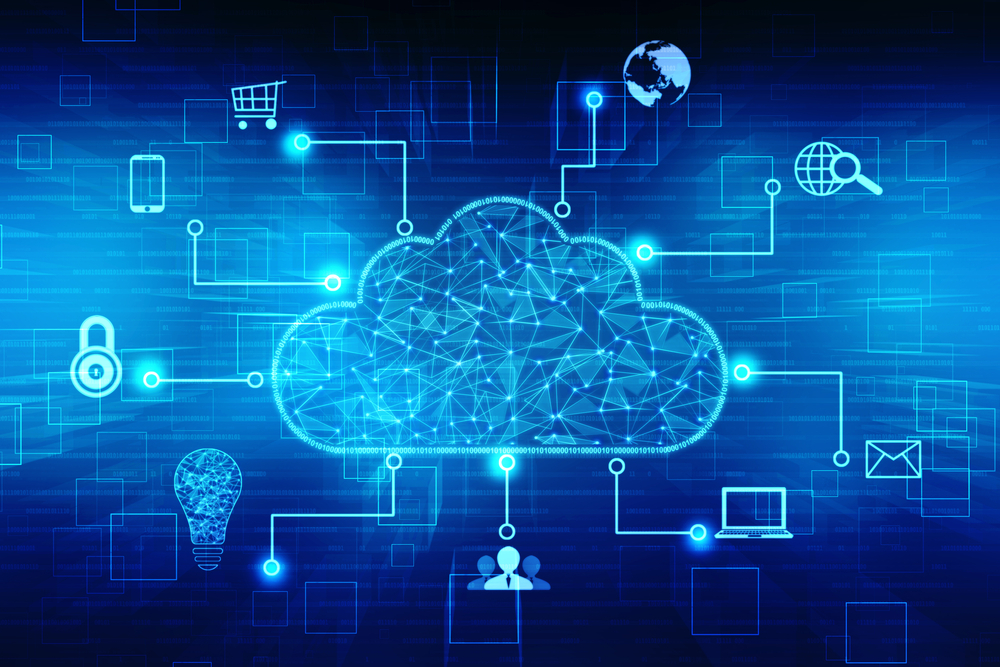
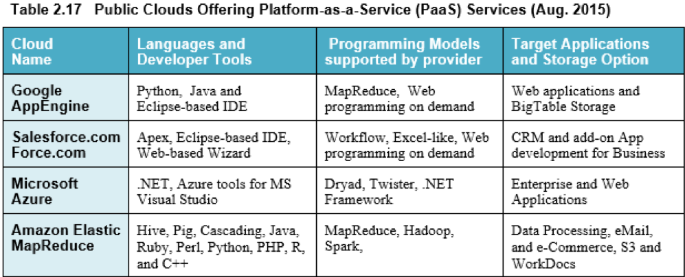

class: middle, center

### AI技术和云技术在视频监控中的应用

# 云计算导论

陈一帅

[yschen@bjtu.edu.cn](mailto:yschen@bjtu.edu.cn)

北京交通大学网络智能实验室

.footnote[铁路综合视频监控维护管理培训班]

---

class: middle, center

# 云计算

.center[.width-90[]]

---

# 内容

- .red[云计算的起源]
- 云计算的定义
- 云计算的服务模式
- 私有云

???
The development of the digital computer led computation to join experiment and theory as a third major paradigm of scientific discovery and engineering design. Supercomputers became essential lab instruments. In the 40 years that followed, the power of supercomputers has grown by a factor of over one billion. But now science is rapidly evolving into a fourth paradigm [153] of data-driven discovery.

T. Hey, S. Tansley, and K. Tolle. The Fourth Paradigm: Data-Intensive Scientific Discovery. Kindle, 2009.

---

# 云计算的起源

- 大型网络公司业务规模庞大
  - 腾讯、百度、阿里、谷歌、亚马逊、微软
- 为自己的业务建设了大规模信息基础设施
  - 存储、计算、网络
- 这些信息基础设施利用率不高
  - 亚马逊首席执行官对其计算机数量和利用率低感到惊讶
  - 因为这是为高峰负载（圣诞节）设计的
- 开放它们
  - 2006 年 8 月 25 日，亚马逊宣布 EC2
  - 云的诞生

???

The technology companies whose business depends on understanding their online customers are the same companies that have built the cloud to handle data analytics workloads.

As a result, data science and machine learning are now among the most in-demand technical specialties [215].

R. Orihuela and D. Bass. Help wanted: Black belts in data, Jun 2015. http://www.bloomberg.com/news/articles/2015-06-04/help-wanted-black-belts-in-data.

To meet the needs of “big data” analysis, cloud builders are rapidly evolving cloud data centers architectures down paths pioneered by the supercomputer vendors.

云的起源

⇒ Birth of Cloud Computing in reality
(Prior theoretical concepts of computing as a utility)

- Amazon’s CEO was amazed by the number of computers in their datacenter and their low utilization
- Computing facilities are designed for peak load (Christmas)
- Needed a way to rent unused capacity, like renting their warehouses and other infrastructure
  ⇒ Develop an application programming interfaces (APIs) to remotely use computers.
- So began the computer rental business that we now call cloud computing.
- Sharing an underutilized resource is good for cloud service customers as well as for the cloud service providers.
  Ref: Raj Jain and Subharthi Paul, "Network Virtualization and Software Defined Networking for Cloud Computing - A Survey," IEEE Communications Magazine, Nov 2013, pp. 24-31, ISSN: 01636804, DOI: 10.1109/MCOM.2013.6658648,

---

# 内容

- 云计算的起源
- .red[云计算的定义]
- 云计算的服务模式
- 私有云

???
The development of the digital computer led computation to join experiment and theory as a third major paradigm of scientific discovery and engineering design. Supercomputers became essential lab instruments. In the 40 years that followed, the power of supercomputers has grown by a factor of over one billion. But now science is rapidly evolving into a fourth paradigm [153] of data-driven discovery.

T. Hey, S. Tansley, and K. Tolle. The Fourth Paradigm: Data-Intensive Scientific Discovery. Kindle, 2009.

---

# 云计算

- 存储
  - 低成本，大容量
- 计算
  - 多核处理器
  - 数据中心，服务器集群
- 网络
  - 100G 以太网
  - 大规模高速 Clos 网络连接
  - 最小化任何规模的延迟

???

Why Big Data Now?

1. Low cost storage to store data that was discarded earlier
2. Powerful multi-core processors
3. Low latency possible by distributed computing: Compute clusters and grids connected via high-speed networks
4. Virtualization  Partition, Aggregate, isolate resources in any size and dynamically change it  Minimize latency for any scale
5. Affordable storage and computing with minimal man power via clouds
    Possible because of advances in Networking
6. Better understanding of task distribution (MapReduce), computing architecture (Hadoop),
7. Advanced analytical techniques (Machine learning)
8. Managed Big Data Platforms: Cloud service providers, such as Amazon Web Services provide Elastic MapReduce, Simple Storage Service (S3) and HBase – column oriented database. Google’ BigQuery and Prediction API.
9. Open-source software: OpenStack, PostGresSQL

使大数据成为可能的因素（大数据侧重分析）

1. Big data has become possible due to low cost storage, high performance servers, high-speed networking, new analytics
2. Google File System, BigTable Database, and MapReduce framework sparked the development of Apache Hadoop.
3. Key components of Hadoop systems are HDFS, Avro data serialization system, MapReduce or YARN computation engine, Pig Latin high level programming language, Hive data warehouse, HBase database, and ZooKeeper for reliable distributed coordination.
4. Discovering patterns in data and using them is called Analytics. It can be descriptive, predictive, or prescriptive
5. Types of Databases: Relational, SQL, NoSQL, NewSQL,
   Key-Value Pair (KVP), Document, Columnar, Graph, and
   Spatial

---

# 云计算的定义

- 一台弹性计算机
  - 按需存储和计算
  - 对象存储以及虚拟机和容器的执行
- 一种模型
  - 对可配置资源（网络，服务器，存储，应用程序和服务）共享池的便捷、按需网络访问
  - 这些资源可以以最少的管理工作量或服务提供商交互，进行快速配置和释放

???

- 资源的可伸缩性
- Infrastructure as a service (IaaS)
  (NIST)

> Cloud computing is a model for enabling convenient, on-demand network access to a shared pool of configurable computing resources (e.g., networks, servers, storage, applications, and services) that can be rapidly provisioned and released with minimal management effort or service provider interaction.

- National Institute of Standards and Technology (NIST)
  http://www.nist.gov/itl/cloud/
- Key Characteristics:
- On-Demand self-service
- Scalable
- Shared
- Ubiquitous access
- Rapid provisioning/released
- Minimal management

四种技术的融合使云成为可能。

- 硬件虚拟化和多核芯片使在云中进行动态配置成为可能
- 网格计算技术奠定了计算云的必要基础
- 面向服务的体系结构（SOA），Web 2.0 和平台的 mashup 的最新进展将云推向了另一个新的台阶
- 自主计算和自动化数据中心操作已启用云

.center[.width-100[]]
(Courtesy of Buyya, Broberg and Goscinski

Why Cloud?

- Clouds are better than private data center, because of they are on-demand, large-scale, and dispersed.

10 Laws of Cloudonomics

1. Utility services cost less even though they cost more. (Customers don't pay when they don't use it).
2. On-Demand trumps forecasting. (Forecasting is often wrong.)
3. The peak of the sum is never greater than the sum of the peaks.
4. Aggregate demand is smoother than individual.
5. Average unit costs are reduced by distributing fixed costs over more units of output.
6. Superiority in numbers is the most important factor in the result of a combat
   (Numerical superiority is the key to winning battles.)
7. Space-time is a continuum.
   (You can reduce time by having more VMs)
8. Dispersion is the inverse square of the latency.
9. Don't put all your eggs in one basket.
   (High reliability with many data centers per CSP).
10. An object at rest tends to stay at rest.
    (Private datacenters are located in suboptimal locations: headquarters).
    While cloud data centers are located optimally)

Ref: Joe Weinman, "The 10 Laws of Cloudonomics," Sep 7, 2008, http://gigaom.com/2008/09/07/the-10-laws-of-cloudonomics

AWS

The introduction by Amazon of its Elastic Compute Cloud (EC2) service in 2006 marked the true beginning of cloud computing.

AWS 公共云由最高管理层，PaaS 和 IaaS 平台以及在全球各个区域的可用性区域中的数据中心之上构建的全球基础架构组成。

.center[.width-100[]]

实时 VM 迁移步骤

将 VM 从 Dom0 域实时迁移到启用 XEN 的目标主机

.center[.width-100[]]

---

# 视频的特点

- 数据量大
- 数据产生速度快
- 数据维度高、类型多
- 要求底层信息基础设施具有可伸缩性（scalability）
- 云提供这种可伸缩性

???

- 虚拟化

> Big Data refers to digital data volume, velocity and/or variety whose management requires scalability across coupled horizontal resources

---

# 内容

- 云计算的起源
- 云计算的定义
- .red[云计算的服务模式]
- 私有云

---

# 云的三种服务模式

- Infrastructure as a service (IaaS)
  - 提供基础设施，如虚拟机，存储和网络
  - 用户可以自己管理，在上面部署自己的操作系统和软件
  - Amazon AWS
- Platform as a service (PaaS)
  - 提供软硬件平台，包括硬件和操作系统，开发和管理工具
  - 用户可以利用这些工具，开发和部署他们的软件
  - Microsoft Azure
- Software as a service (SaaS)
  - 具有用户界面的完整应用程序，用户直接用
  - 如 Salesforce.com

???

Cloud Service Models

Application
Operating System
Hardware

- Infrastructure as a service (IaaS): Provide virtual machines, storage, and network facilities that users can manage. Users install their own operating systems and software, e.g., Amazon Web Services
- Platform as a service (PaaS): Includes hardware and operating systems, development and administrative tools. Users develop and deploy their software, e.g., Microsoft Azure
- Software as a service (SaaS): Complete application with a user interface, e.g., Google Docs, Gmail, Salesforce.com

---

# PaaS

.center[.width-100[]]

---

# SaaS

- Salesforce CRM（客户关系管理）SaaS 服务
  - 销售云：管理客户资料，跟踪商机，优化活动
  - 服务云：创建，跟踪和路由服务案例，包括社交媒体网络服务
  - 市场云：社交营销，从社交媒体中识别销售线索，发现粉丝
  - 数据云：获取和管理 CRM 记录
  - 协作云：业务协作
  - 分析云：基于机器学习的销售绩效分析
  - 定制云：在标准 CRM 应用程序之上创建附加应用程序

---

# 内容

- 云计算的起源
- 云计算的定义
- 云计算的服务模式
- .red[私有云]

---

# 部署私有云

- VMware vSphere 数据中心虚拟化套件
- OpenStack 开源云计算系统

---

# 小结

- 云计算的起源
- 云计算的定义
- 云计算的服务模式
  - IaaS，PaaS, SaaS
- 私有云
