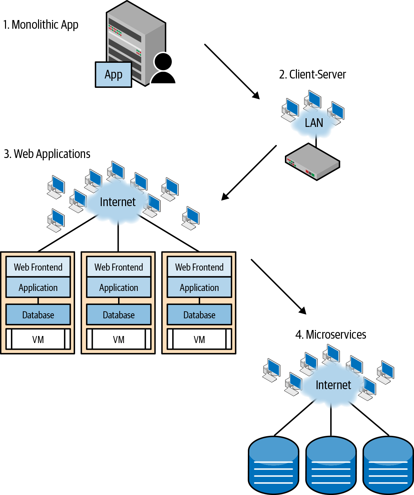
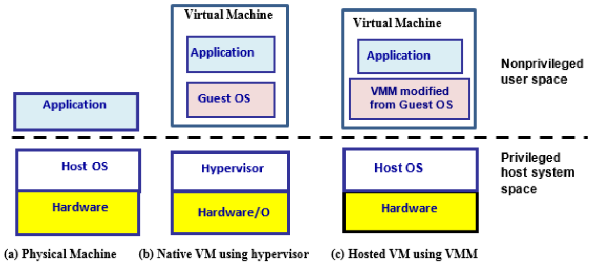
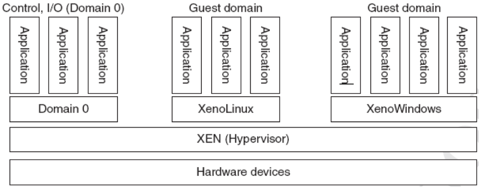
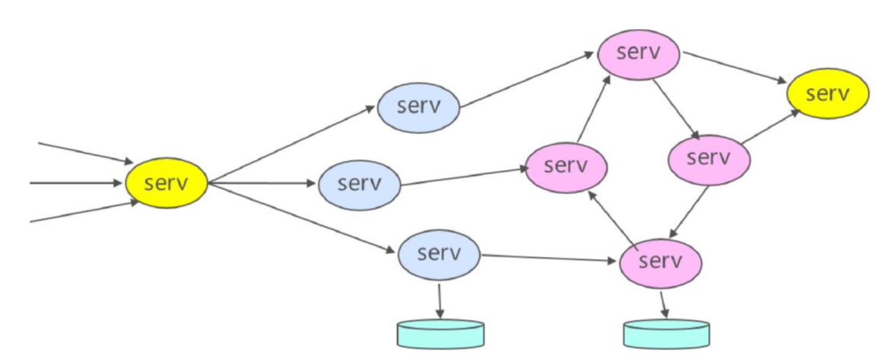

class: middle, center

### AI技术和云技术在视频监控中的应用

# 云计算模型

陈一帅

[yschen@bjtu.edu.cn](mailto:yschen@bjtu.edu.cn)

北京交通大学网络智能实验室

.footnote[铁路综合视频监控维护管理培训班]

---

# 内容

- .red[虚拟化]
- 虚拟机
- 容器
- 微服务

---

# 云计算应用开发环境

.center[.width-60[]]

???

- 开放给


---

class: middle, center

# 虚拟化

云计算基于虚拟化

???

Resources virtualization and representative software products.
Virtualization

五级
Servers：虚拟机，VMWare EXS Server
Desktop 虚拟桌面，
Networks VPN，VLAN，OpenStack
Storage，NAS，S3
Application：容器，Docker

---

# 背景知识

- 程序
  - 一些指令
- 操作系统（OS）
  - 允许多个用户程序同时运行，分享资源
  - 进行状态管理、程序上下文切换、I/O 访问控制
- 程序不能进行状态管理、I/O 访问指令，因为会接入其它程序的状态
  - 要通过操作系统执行这些指令

???

计算机资源与程序

Any modern computer has a set of basic resources: CPU data registers, memory addressing mechanisms, and I/O and network interfaces. The programs that control the computer are just sequences of binary codes corresponding to instructions that manipulate these resources, for example to ADD the contents of one register to the contents of another.

OS

Important instructions for performing context switches, in which the computer stops executing one program and starts executing another. These state management instructions plus the I/O instructions are termed privileged. Such instructions are usually directly executed only by the OS, because you do not want users to be able to access state associated with other computations.

The OS has the ability to allow user programs (encapsulated as processes) to run the unprivileged instructions. But as soon as the user program attempts to access an I/O operation or other privileged instruction, the OS traps the instruction, inspects the request, and, if the request proves to be acceptable, runs a program that executes a safe version of the operation.

---

# 虚拟化

- 提供看起来真实，但实际上是在软件中处理的这些指令的过程，被称为虚拟化
- 其他类型的虚拟化（例如虚拟内存）在操作系统的指导下由硬件直接处理
- 1960 年代末和 1970 年代初，IBM 和其他公司在虚拟化方面做了很多工作，最终证明可以虚拟化整个计算机
  - R. J. Creasy. The origin of the VM/370 time-sharing system. IBM Journal of Research and Development, 25(5):483–490, 1981.

???

This process of providing a version of the instruction that looks real but is actually handled in software is called virtualization.

Other types of virtualization, such as virtual memory, are handled directly by the hardware with guidance from the OS.

In the late 1960s and early 1970s, IBM and others created many variations on virtualization and eventually demonstrated that they could virtualize an entire computer [104].

---

# 内容

- 虚拟化
- .red[虚拟机]
- 容器
- 微服务

---

# 虚拟机

- Virtual Machine（VM）
- 在虚拟机管理程序上运行的 OS
- 是一个完整机器的软件映像，可以将其加载到服务器上并像其他程序一样运行

.center[.width-100[]]

???

We refer to the guest OSs running on the hypervisors as VMs.

Some hypervisors run on top of the host machine OS as a process, such as VirtualBox and KVM

A virtual machine is just the software image of a complete machine that can be loaded onto the server and run like any other program.

The server in the data center runs a piece of software called a hypervisor that allocates and manages the server’s resources that are granted to its “guest” virtual machines.

the key idea is that when you run in a VM, it looks exactly like a server running whatever operating system the VM is configured to run.

---

# 两种虚拟机

- Native 虚拟机
  - 基于虚拟机管理程序 Hypervisor
  - Hypervisor 在 OS 之下，允许多个 OS 同时运行，分享同一个硬件资源
  - 管理和分配服务器资源
  - 如 Citrix Xen，Microsoft Hyper-V，VMWare ESXi
- Hosted 虚拟机
  - 基于 VMM
  - 虚拟机管理程序作为进程运行在主机操作系统上
  - 如 VirtualBox 和 KVM

---

# 例：XEN Hypervisor

- Hypervisor 在 OS 之下
- 允许多个 OS 同时运行，分享同一个硬件资源

.center[.width-100[]]

???

a program that manages the virtualization of the hardware on behalf of multiple distinct OSs.

The OS allows multiple user processes to run simultaneously by sharing the resources among them; the hypervisor below the OS allows multiple OSs to share the real physical hardware and run concurrently.

Many hypervisors are available today, such as Citrix Xen, Microsoft Hyper-V, and VMWare ESXi.

---

# 虚拟机带来的好处

- 云可以选择使用哪个服务器来运行请求的 VM 实例
- 如需要，可在一台服务器上同时运行多个 VM
- 同一服务器上的不同 VM 中运行的用户应用程序之间彼此之间几乎完全没有察觉
- 可以监视每个 VM 的运行状况，记录事件并重启 VM
- 一个 VM 实例崩溃，不会使整个服务器崩溃

???

cloud management system (sometimes called the fabric controller) can select which server to use to run the requested VM instances, and it can monitor the health of each VM.

If needed, the cloud monitor can run many VMs simultaneously on a single server. If a VM instance crashes, it does not crash the server.

The cloud monitor can record the event and restart the VM.

User applications running in different VMs on the same server are largely unaware of each other.

升级集群弹性并提高共享服务器的利用率。
硬件级的虚拟化
XEN，KVM，Hyper V，VMWare，VirtualBox

---

# 虚拟化的好处

- 最小化硬件成本（CapEx）
  - 一台物理硬件上的多个虚拟服务器
- 能够轻松将 VM 移至其他数据中心
  - 提供灾难恢复，硬件维护
  - 跟随太阳（活跃的用户）或跟随月亮（便宜）
- 合并空闲的工作负载，释放未使用的物理资源
  - 用户流量是突发性的和异步的，提高设备利用率，省电
- 更轻松的自动化（降低 OpEx）
  - 简化的硬件和软件供应/管理
- 可扩展、灵活，支持多种操作系统

???

Advantages of Virtualization

- Minimize hardware costs (CapEx)
  Multiple virtual servers on one physical hardware
- Easily move VMs to other data centers
- Provide disaster recovery. Hardware maintenance.
- Follow the sun (active users) or follow the moon (cheap power)
- Consolidate idle workloads. Usage is bursty and asynchronous. Increase device utilization
- Conserve power
  Free up unused physical resources
- Easier automation (Lower OpEx)
  Simplified provisioning/administration of hardware and software
- Scalability and Flexibility: Multiple operating systems

Ref: http://en.wikipedia.org/wiki/Platform_virtualization
Ref: K. Hess, A. Newman, "Practical Virtualization Solutions: Virtualization from the Trenches," Prentice Hall, 2009,
ISBN:0137142978

---

# 灵活的计费

- 例：亚马逊 AWS 的三种虚拟机实例的计费方式
  - On-demand instances
  - Reserved instances：1~3 年
  - Spot instances：竞价，闲时用，区域有关
- 弹性配置器
  - Ryan Chard 弹性配置器，成本降低多达 95％
  - R. Chard, K. Chard, K. Bubendorfer, L. Lacinski, R. Madduri, and I. Foster. Cost-aware cloud provisioning. In IEEE 11th International Conference on e-Science, pages 136–144, 2015.

???

on-demand instances
Amazon, for example, these range from less than a cent per hour for a nano instance to several dollars per hour for a big-storage or graphical processing unit (GPU) system. And that is just for on-demand instances, instances that you request when you need them and pay for by the hour.

Reserved instances provide lower costs (by up to 75%) when you reserve for between one and three years.

spot instances allow you to bid on spare Amazon EC2 computing capacity. You indicate the price that you are prepared to pay, and if Amazon has unused instances and your bid is above the current bid price, you get the machines that you asked for—with the proviso that if your bid price is exceeded during the lifetime of your instances, the instances are terminated and any work executing is lost. Spot prices vary considerably; but you can save a lot of money in this way, especially if your computations are not urgent.

Spot instances, can vary across Amazon regions. Thus, a really cost-conscious cloud user might be tempted to search across different instance types and regions for the best deal for a particular application. That would be a time- consuming process if you had to do it yourself, but researchers have built tools to do just that.

Ryan Chard, for example, has developed a cost-aware elastic provisioner that can reduce costs by up to 95% relative to a less sophisticated approach [90].

R. Chard, K. Chard, K. Bubendorfer, L. Lacinski, R. Madduri, and I. Foster. Cost-aware cloud provisioning. In IEEE 11th International Conference on e-Science, pages 136–144, 2015.

---

# 虚拟机的问题

- 成本问题
  - 每个 VM 都需要一个操作系统（OS）
  - 每个操作系统都需要许可证 ⇒ CapEx
  - 每个操作系统都有自己的计算和存储开销
  - 需要维护，更新 ⇒ OpEx
  - VM 成本 = 添加了 CapEx + OpEx
- 性能问题
  - 启动操作系统，需要额外的 Overhead
  - VM 是完整的 OS 实例，因此可能需要几分钟才能启动

???

Problems of Virtualization

Each VM requires an operating system (OS)

- Each OS requires a license ⇒ CapEx
- Each OS has its own compute and storage overhead
- Needs maintenance, updates ⇒ OpEx
- VM Tax = added CapEx + OpEx

---

# 内容

- 虚拟化
- 虚拟机
- .red[容器]
- 微服务

---

class: middle, center

# 容器

具有虚拟机的所有良好特性，同时更轻量级

---

# 介绍

- 容器是另一种虚拟化方法
- 在同一操作系统上运行许多应用
  - 这些应用共享操作系统及其开销
- 但不会互相干扰
  - 未经明确许可就无法访问彼此的资源
- 像公寓一样 ⇒ 容器

???

- Run many apps in the same virtual machine
- These apps share the OS and its overhead
- But these apps can’t interfere with each other
- Can’t access each other’s resources without explicit permission
- Like apartments in a complex ⇒ Containers

---

# 容器的隔离

- 容器将应用程序及其所有库依赖关系和数据打包到一个易于管理的单元中
- 每个容器有自己的网络，主机名，域名，进程，用户，文件系统，IPC，互不干扰
- Docker 允许在封装所有应用程序依赖项的容器中供应应用程序
  - 该应用程序可以看到一个完整的私有进程空间，文件系统和网络接口，与同一主机操作系统上其他容器中的应用程序隔离
  - 例如，容器中的“显示进程”（在 Linux 上为 ps）命令将仅显示容器中的进程

---

# 容器的轻量级

- 在操作系统上提供隔离，轻量级
- 比 VM 轻
  - 是一个应用
  - 应用和它的依赖库、配置、数据的打包
- 启动快
  - 可以在几秒钟内将应用程序初始化并运行
- 比 Process 重
  - 一个容器内能运行多个 Process

???

微服务。容器

- Virtual Machines provide scalability, mobility, and cost reduction but need OS which increase resource requirements
- Containers provide isolation on a single OS and are lightweight
- Docker allows managing containers
- Docker Swarm and Kubernetes allow orchestrating a large number of containers
- Docker provides overlay networking and security

---

# 容器的低成本

- 在一个操作系统上运行多个容器
- 所有容器共享操作系统
- CapEx 和 OpEx

???

Multiple containers run on one operating system on a virtual/physical machine

- All containers share the operating system ⇒ CapEx and OpEx
- Containers are isolated ⇒ cannot interfere with each other
- Own file system/data, own networking ⇒ Portable

Docker 正被 containerd 取代
Kubernete 用 CRI-containerd

Key Reference: N. Poulton, "Docker Deep Dive," Oct 2017, ISBN: 9781521822807 (Not a Safari Book)

---

# 容器的优点

- 具有虚拟机的所有良好特性
- 可移植
  - 容器从 Image 中生成，也可以另存为 Image
  - 同一个 Image 可以在个人计算机，数据中心或云中运行
  - 可以停下来、保存并移动到另一台计算机上或以后运行
- 可扩展
  - 可以在同一台计算机或不同计算机上运行多个副本
- 灵活
  - 可根据容器构建时的设计来限制或不限制操作系统资源

???

When you launch the container, the application can be configured to start up, go through its initialization, and be running in seconds.

Containers have all the good properties of VMs

- Come complete with all files and data that you need to run
- Multiple copies can be run on the same machine or different machine ⇒ Scalable
- Same image can run on a personal machine, in a data center or in a cloud
- Operating system resources can be restricted or unrestricted as designed at container build time
- Isolation: For example, “Show Process” (ps on Linux) command in a container will show only the processes in the container
- Can be stopped. Saved and moved to another machine or for later run

Ref: M. K. Weldon "The Future X Network: A Bell Labs Perspective," CRC Press, 2016, 476 pp., ISBN:9781498779142

---

# Docker

- 使用 Google 的 Go 编程语言编写
- 管理容器，提供覆盖网络和安全性
- 提供容器之间的隔离，帮助他们共享操作系统
- 最初由 Docker.com 开发，现已开源
- 可从 Docker.com 下载用于 Linux，Windows 和 Mac
- 两个版本：
  - 社区版（CE）：免费进行实验
  - 企业版（EE）：用于带付费支持的部署
- Docker Swarm 和 Kubernetes 管理大量容器

???

- Docker allows managing containers
- Docker Swarm and Kubernetes allow orchestrating a large number of containers
- Docker provides overlay networking and security

mid-2013, a little company called dotCloud released a tool that provided a better way to deploy encapsulated applications. This tool became Docker [71], and dotCloud became Docker, Inc. docker.com .

D. Bernstein. Containers and cloud: From LXC to Docker to Kubernetes. IEEE Cloud Computing, 1(3):81–84, 2014.

Hyper-V Containers

- Microsoft allows two kinds of containers:
- Windows Server Containers: Multiple containers on a single
  VM (like Docker containers)
- Hyper-V containers: Each container runs on its own VM
  ⇒ No need for a Linux

Kata Containers

- Lightweight virtual machines
- Dedicated VMs to run one and only one container
- Combines “Intel Clear Containers” and “HyperV runV”
- Open source project under OpenStack Foundation
- Compatible with the OCI specs for Docker containers
- Compatible with CRI for Kubernetes
- Performance like containers, isolation and security like VMs
- Six Components: Agent, Runtime, Proxy, Shim, Kernel and QEMU 2.9
- Kubernetes will be extended to provision VMs (Kata Containers)
- OpenStack’s VM orchestration engine (Nova) will be extended to handle containers
- Package once and run anywhere
- VMware, Google, and Amazon are all moving towards this approach
- No installable distribution of Kata containers yet (April 22, 2018)

N. Poulton, "Docker Deep Dive," Oct 2017, ISBN: 9781521822807 (Not a Safari Book) Highly Recommended.

OS 级的虚拟化，用户 app 的隔离

Docker 引擎访问 Linux 内核功能以实现不同应用程序容器的隔离虚拟化

---

# Image 存储库（Registries）

- Image 存储在 Registries 中
  - 每个 Image 都有几个标签，例如 v2，最新，...
  - 每个 Image 都通过其 256 位哈希值进行标识
- 主机上有本地存储库
- 网络存储库
  - Docker Hub 存储库，经过 Docker 审查的 Image
  - 非官方存储库，未经审核的 Image，谨慎使用
- 启动 Image 时，在本地存储库中找不到的任何组件，会从指定位置下载

???
Image Registries

- Containers are built from images and can be saves as images
- Images are stored in registries
- Local registry on the same host
- Docker Hub Registry: Globally shared - Private registry on Docker.com
- Any component not found in the local registry is downloaded from specified location
- Official Docker Registry: Images vetted by Docker
- Unofficial Registry: Images not vetted (Use with care)
- Each image has several tags, e.g., v2, latest, ...
- Each image is identified by its 256-bit hash

---

# Docker Hub

- https://hub.docker.com/
- 公共资源，可以在其中存储你的容器，搜索和下载数百个公共容器
- 创建一个免费的 Docker 帐户，并将容器保存到 Docker Hub

```docker
docker push yourname/bottlesamp
```

- 然后就可以将容器下载到云中并运行

???

a public resource where you can store your own containers, and search for and download any of the hundreds of public containers.

---

# 运行容器

```docker
Docker run -d -p 8000:8000 yourname/bottlesamp
```

- 下载

  - 首次运行时，会下载所有组件，需要时间
  - 组件下载后，缓存在本地计算机上

- 其它命令
  - ls, exec, stop, start, rm, inspect

???

Docker Commands

- docker container run: Run the specified image
- docker container ls: list running containers
- docker container exec: run a new process inside a container
- docker container stop: Stop a container
- docker container start: Start a stopped container
- docker container rm: Delete a container
- docker container inspect: Show information about a container

---

# 内容

- 虚拟化
- 虚拟机
- 容器
- .red[微服务]

---

# 微服务

- 大型云应用程序的主要设计范式
- 消息 + 参与者
  - 计算由许多进行消息通信的参与者执行
  - 每个参与者都有自己的内部专用内存，并且在收到消息后开始行动
  - 根据消息，它可以更改内部状态，也可以向其他参与者发送消息
  - 参与者可实现为功能单一的 Web 服务 （Unix 设计原则）
- 如果服务无状态，就是微服务
  - 微服务通常被实现为容器实例

???

computing is performed by many actors that communicate via messages.

- Each actor has its own internal private memory and goes into action when it receives a message. Based on the message, it can change its internal state and then send messages to other actors. You can implement an actor as a simple web service. If you limit the service to being largely stateless, you are now in the realm of microservices, a dominant design paradigm for large cloud applications. Microservices are often implemented as container instances

---

# 微服务系统模型

- 微服务构成群（Swarm）
- 微服务利用云中的虚拟网络进行异步通信

.center[.width-100[]]

???

Conceptual view of a swarm of communicating microservices or actors.

asynchronous swarm of communicating processes or services distributed over a virtual network in the cloud

individual processes may be stateless, such as a simple web service, or stateful, as in the actor programming model.

---

# 微服务适合大规模互联网应用

- 大型在线服务的需求
  - 需要支持数千个并发用户
  - 在维护和升级的同时，还必须保持每天 24 小时在线
- 微服务集群，可伸缩

???

design and build a large, heterogeneous application that is secure, maintainable, fault tolerant, and scalable.

DevOps

particularly important for large online services that need to support thousands of concurrent users.

The app must remain up twenty-four hours a day while being maintained and upgraded.

This task is closely related to a software engineering methodology called DevOps, which integrates product delivery, quality testing, feature development, and maintenance releases in order to improve reliability and security and provide faster development and deployment cycles.

From the programmer’s perspective this is a “you built it, so now you run it” philosophy. Updates to parts of this system occur while the system is running, so the developers are tightly integrated with the IT professionals who manage the system.

---

# 微服务组件设计

- 将应用程序划分为小型、独立的微服务组件
- 每个微服务必须能独立于其他微服务进行管理
  - 复制，扩展，升级和部署
- 每个微服务仅具单一功能，在有限上下文中运行
  - 责任有限，对其他服务的依赖也有限
- 所有微服务都应能支持不断发生故障和恢复
- 尽可能重用现有可信服务，如数据库，缓存和目录

---

# 微服务组件间通信

- 组件之间通过简单，轻便的机制进行通信
- 通信机制
  - REST Web 服务调用
  - RPC 机制（例如 Google 的 Swift）
  - 高级消息队列协议（AMQP）

???

partition the application into small, independent service components communicating with simple, lightweight
mechanisms.

The microservice paradigm design rules dictate that each microservice must be able to be managed, replicated, scaled, upgraded, and deployed independently of other microservices.

Each microservice must have a single function and operate in a bounded context; that is, it has limited responsibility and limited dependence on other services.

When possible one should reuse existing trusted services such as databases, caches, and directories.

All microservices should be designed for constant failure and recovery.

The communication mechanisms used by microservice systems are varied: they include REST web service calls, RPC mechanisms such as Google’s Swift, and the Advanced Message Queuing Protocol
(AMQP).

---

# 微服务的广泛应用

- 微服务理念已被广泛采用
  - Netflix，Google，Microsoft，Spotify 和 Amazon
- 云中的应用被设计成可扩展的服务
  - 如 Web 服务器或移动应用程序的后端
  - 接受来自远程客户端的连接，并根据客户端请求执行一些计算并返回响应
  - 处理来自远程传感器的事件，通知控制系统如何响应
  - 如当地球传感器检测到以明显方式发生的地面震动时，会发出地震警告
- 大数据系统

???

The microservice philosophy has been adopted in various forms by many companies, including Netflix, Google, Microsoft, Spotify, and Amazon.

The cloud is designed to host applications that are realized as scalable services, such as a web server or the backend of a mobile app. Such applications accept connections from remote clients and, based on the client request, perform some computation and return a response.

processes events from remote sensors, with the goal of informing a control system on how to respond, as when geosensors detecting ground motion tremors occurring in a significant pattern sound an earthquake warning.

---

# 微服务的管理

- 大规模微服务应用，需要管理大量分布式通信服务
- 管理平台
  - 启动实例
  - 停止实例
  - 创建新版本
  - 扩展实例数量

???

To build a substantial microservice application, you need to build on a platform that can manage large collections of distributed, communicating services.

use a resource manager to launch instances, stop them, create new versions, and scale their number up and down.

---

# 管理工具

- Mesos
- Docker
  - Kubernetes: Google 云容器调度程序
  - Swarm: Docker 容器调度程序
  <!-- - Compose: Docker 容器组管理工具，允许容器通过消息相互通信 -->

---

# 小结

- 虚拟化
- 虚拟机
- 容器
- 微服务
