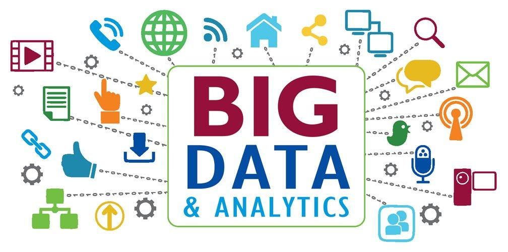
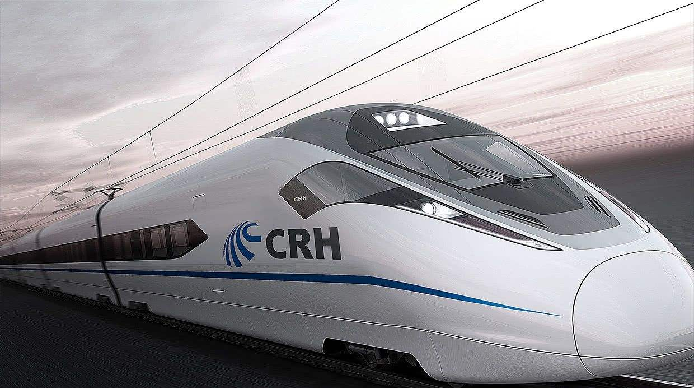
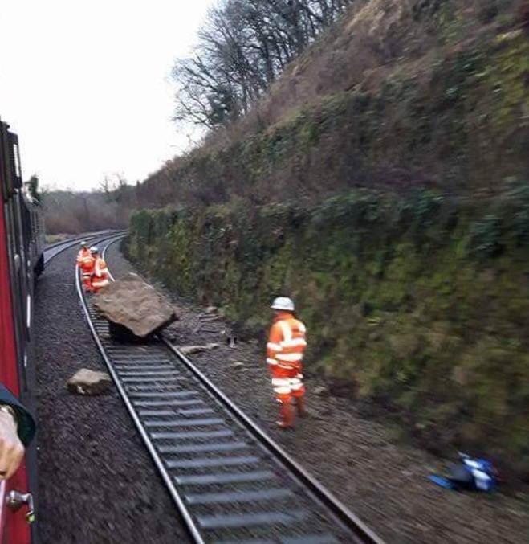
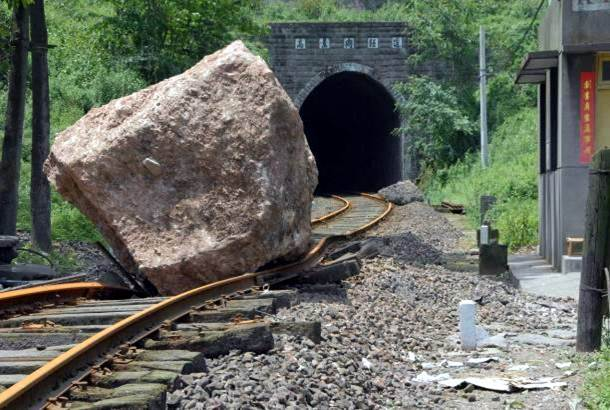
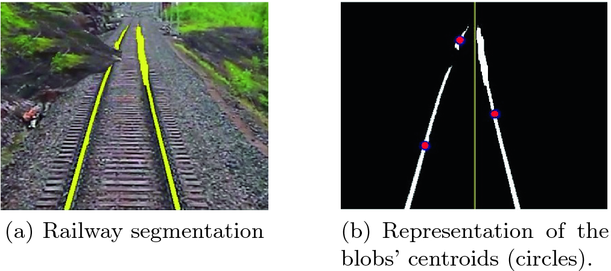
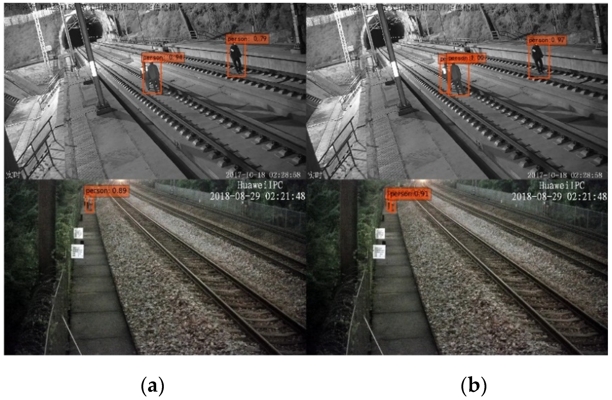
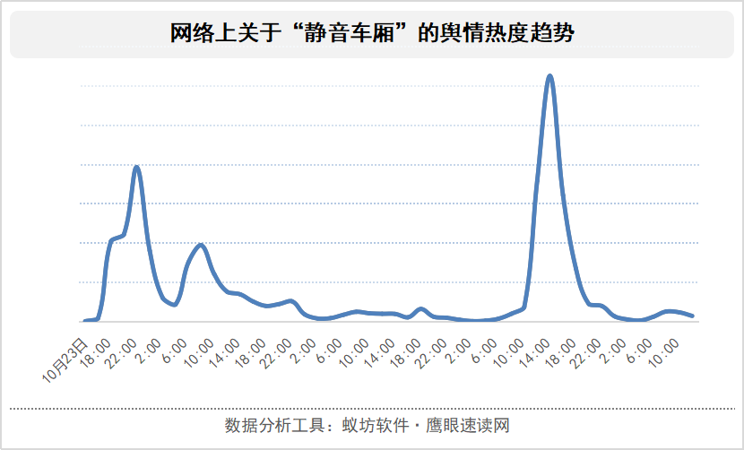
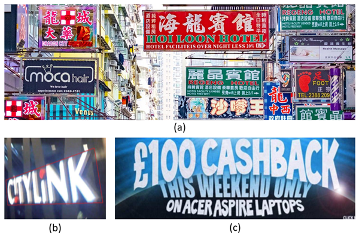
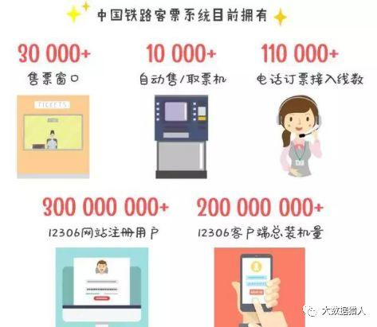
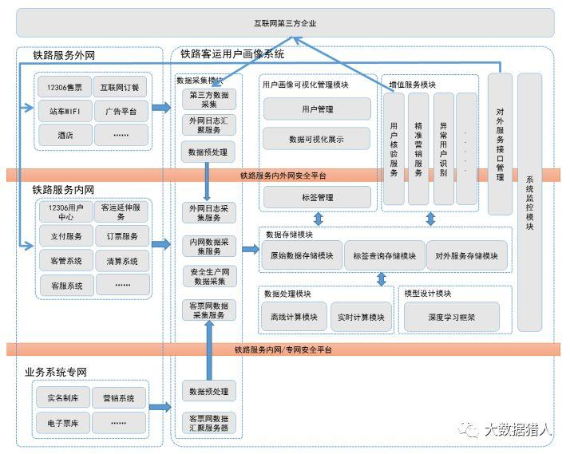

class: middle, center

##### 中国铁路兰州局集团有限公司“十百千”人才项目

## 面向智能铁路的人工智能技术与应用

# 导论

陈一帅

.smaller[[yschen@bjtu.edu.cn](mailto:yschen@bjtu.edu.cn)]

.footnote[北京交通大学网络智能实验室]

---
# 内容

- 背景
- 概念
- 应用

---
# 内容

- .red[背景]
- 概念
- 应用

---
# 背景

- 2020年4月17日，中共中央政治局会议

.center[.width-100[]]

???

- 以新发展理念为引领
- 以技术创新为驱动
- 以信息网络为基础
- 面向高质量发展需要
- 提供数字转型、智能升级、融合创新等服务的基础设施体系

---
# 趋势

- 传统基础设施转型升级
  - 智能交通基础设施
- 加强新型基础设施建设
  - 网络：5G、物联网、工业互联网、卫星互联网
  - 新技术：人工智能、云计算、区块链
  - 算力：数据中心、智能计算中心
- 技术
  - .red[大数据]，.red[人工智能]

---
# 内容

- 背景
- .red[概念]
- 应用

---
class: middle, center

# 什么是大数据？

Big Data

.center[.width-80[]]

---
# 大数据时代

- 麦肯锡最早提出大数据时代
  - “数据，已渗透到每一行业和业务职能领域，成为重要生产因素”
  - “人们对海量数据的挖掘和运用，预示着新一波生产率增长和消费者盈余浪潮的到来”

.center[.width-60[]]

???
大数据的定义

- 海量、高增长率和多样化的信息
  - 常规软件工具无法捕捉、管理和处理
  - 需要新的处理模式

---
# 价值金字塔模型

- 数据
- 知识
- 信息
- 智慧

.center[.width-50[]]

---
# 什么是人工智能？

使计算机像人那样聪明

.center[.width-80[]]

???

---
# 生活中的人工智能

识别垃圾邮件

.center[.width-80[]]

---
# 生活中的人工智能

人脸识别

.center[.width-80[]]

---
# 生活中的人工智能

预测房价

.center[.width-100[]]

---
# 问题和机遇

- 更强决策力、洞察力和流程优化力
  - 更深刻、全面的洞察能力
  - 预测性分析，预测未来

.center[.width-70[]]

---
# 内容

- 背景
- 概念
- .red[应用]

???
- 应用特点
  - 分析
  - 读多，Append多
  - 很少更新

???
- 出现以下情况，考虑大数据技术
  - 数据多，一个机器都存不下
  - 计算耗时，一个分析要跑5个小时

---

# 银行、金融

- 应用
  - 贷款、保险、发卡，股票投资组合和趋势分析
- 价值
  - 增加市场份额，提高用户忠诚度，降低风险

.center[.width-60[]]

---
# 医疗

- 应用
  - 共享电子病历，快速诊断，远程医疗
- 价值
  - 提高诊疗质量，加快诊疗速度

.center[.width-70[]]

---
# 互联网

- 应用
  - 在线广告，商品评分、推荐，搜索结果优化
- 价值
  - 盈利

.center[.width-70[]]

---
# 零售

- 应用
  - 基于位置的精确促销
  - 社交网络购买行为分析
- 价值
  - 激化用户购买热情
  - 顺应用户购买习惯

.center[.width-70[]]

---
class: middle, center

# 铁路应用

.center[.width-50[]]

---
class: middle, center

# 图像相关

---
# 视频监控

实例分割

.center[.width-100[]]

---
class: middle, center
# 视频监控

语义分割视频（2017）

---
class: middle, center
# 缺陷检测

视频

---
# 人脸识别

- 刷脸进站

.center[.width-60[]]

---
# 交通流量计数

.center[.width-100[]]

???
https://towardsdatascience.com/review-retinanet-focal-loss-object-detection-38fba6afabe4

---
class: middle, center
# 交通流量计数

路口视频

---
# 交通信号识别

.center[.width-90[]]

---
class: middle, center
# 铁轨识别

视频

---
class: middle, center
# 障碍物识别

.center[.width-60[]]

---
class: middle, center
# 障碍物检测

.center[.width-90[]]

???
class: middle, center
# 障碍物检测

.center[.width-90[]]

---
class: middle, center
# 行人检测

.center[.width-90[]]

---
class: middle, center
# 站场安全

.center[.width-80[]]

---
class: middle, center
# 各种天气

.center[.width-60[]]

---
class: middle, center
# 夜间

.center[.width-90[]]

---
class: middle, center
# 道口监控

视频

---
class: middle, center
# 机器人

---
# 工业机器人

.center[.width-100[]]

---
class: middle, center
# 流水线机器人

分捡物体视频（2018）

---
class: middle, center
# 折毛巾（2010）

<!-- <video width="700" controls>
    <source src="./video/towel.mp4" type="video/mp4">
</video> -->

视频

---
class: middle, center
# 自动驾驶（2016）

视频

---
class: middle, center

# 文本/语音相关

---
# 舆情监控

.center[.width-100[]]

---
# 人机对话

.center[.width-100[]]

---
# 文本识别
.center[.width-100[]]

---
class: middle, center
# 智能交通

---
# 流量监控

.center[.width-90[]]

.center[北京地铁入口流量]
.smallest[Haodong Yin, etc., Modeling and Simulating Passenger Behavior for a Station Closure in a Rail Transit Network, 2016]

---
# 流量预测

.center[.width-90[]]
.smallest[Yun Wang, Deep Learning for Bus Passenger Demand Prediction Using Big Data]

???

.smallest[Zhenzhu Wang, Yishuai Chen, Jian Su, Yuchun Guo, Yongxiang Zhao, etc. Measurement and Prediction of Regional Traffic Volume in Holidays, IEEE Intelligent Transportation Systems Conference (ITSC) 2019, pp.486-491]
魏中锐，基于深度学习的交通流量预测，硕士学位论文，2019年，导师：郭宇春

---
# 风险信息采集和分析

.center[.width-110[]]
.center[厦门公路网监控大数据平台]
.smallest[Xiaoliang Fan, etc., Big Data Analytics and Visualization with Spatio-Temporal Correlations for Traffic Accidents, ICA3PP 2015]

---
# 风险信息分析

.center[.width-100[]]
.center[厦门公路网事故时间/地理位置信息分析]

---
# 区域风险预测

- 北京公路网事故多发地区小时级预测
  - 考虑天气、时间、日期（周日/周末/假日）、车速

.center[.width-110[]]
.smallest[Honglei Ren, etc. A Deep Learning Approach to the Prediction of Short-term Traffic Accident Risk, 2017, arXiv:1710.09543v1]

---
# 区域风险预测

- 北京公路网事故多发地区小时级预测结果

.center[.width-110[]]
.smallest[Honglei Ren, etc. A Deep Learning Approach to the Prediction of Short-term Traffic Accident Risk, 2017, arXiv:1710.09543v1]

---
# 路段风险预测

- 美国休斯顿公路网周日下午5点-6点路段风险预测

.center[.width-90[]]
.smallest[Linhua Li, A GIS-Based Bayesian Approach For Analyzing Spatial-Temporal Patterns Of Traffic Crashes, MS Thesis, Texas A&M University, August 2006]

---
# 故障路段影响评估和规避

.center[.width-110[]]
.center[.smaller[（a）根据当前事故的影响计算出的路线（b）驾驶员接近事故位置时受影响区域的时变扩展（c）根据影响的准确预测计算出的路线]]
.smallest[Bei Pan, etc., Forecasting Spatiotemporal Impact of Traffic Incidents on Road Networks,
]

???
(a) route calculated based on current incident’s impact (b) time-varying expansion of impacted region as driver approaches the incident location (c) route calculated based on accurate prediction of impact

事故风险预测

.center[.width-60[]]
.center[仿真结果，考虑人流移动性]
.smallest[Quanjun Chen, etc., Learning Deep Representation from Big and Heterogeneous Data for Traffic Accident Inference, AAAI 2016]

---
class: middle, center

# 运营优化

---
# 运输管理

- 现代化、智能化的铁路运输管理
  - 安全、高效
  - 客户满意
  - 利润

.center[.width-60[]]

---
# 运营

- 服务国家、服务人民
- 提质增效、企业利润

.center[.width-90[]]

---
# 用户分析

铁路在满足我国人民出行需求方面处于核心地位

.center[.width-80[]]

---
# 用户分析

- 2018年呼和浩特局
  - 旅客发送3566.6万人次，客票收入24.7亿元
  - 2019年国家铁路旅客发送35.7亿人次

.center[.width-90[]]

---
# 用户分析

海量核心用户群，关系到国计民生

.center[.width-70[]]

---
# 用户分析

.center[.width-100[]]

---
# 用户分析

.center[.width-90[]]

---
# 用户运营

- 客票、零售、WiFi、广告、购物、消费

.center[.width-100[]]

???

http://www.woshipm.com/data-analysis/3450367.html

---
# 动态票价

- 客运营销
  - 根据流量情况，动态调整票价
  - 航空公司

.center[.width-90[]]

---
# 零售

- 互联网订餐系统
- 高铁零售

.center[.width-80[]]

---
# 网络及网络内容服务

- 站车WIFI运营服务系统
  - 腾讯+吉利，高铁Wifi，43亿
  - 视频、广告、购物、消费

.center[.width-70[]]

---
# 铁路用户大数据分析系统

.center[.width-100[]]

---
# 小结

- 问题
  - 大数据时代，铁路运输面临重大机遇
- 技术
  - 大数据 + 人工智能技术
  - 预测性分析、优化设计
- 助力铁路运输运营
  - 更强决策力
  - 更深刻、全面的洞察能力

---
# 小结

- 目标
  - 现代化、智能化的铁路运输管理
  - 安全、高效
  - 客户满意
  - 利润
- 应用
  - 交通流量分析与预测
  - 故障检测
  - 风险监控、分析、预测与响应
  - 现代化运营手段