class: middle, center

#### 国铁集团铁路通信技术管理培训班

## 机器学习和人工智能

# 人工智能

陈一帅

.smaller[[yschen@bjtu.edu.cn](mailto:yschen@bjtu.edu.cn)]

.footnote[北京交通大学网络智能实验室]
---
# 内容

- 定义
- 历史
- 机器学习
- 应用

---
# 内容

- .red[定义]
- 历史
- 机器学习
- 应用

---
# 智能

- 理解：文字、视觉
- 交流：文字、语音
- 计划：设计、规划
- 学习：知识、模仿

---
class: middle, center

# 人工智能

AI：Artificial Intelligence

使计算机像人那样聪明

???

---
# 图灵测试（1）

让人认为是在和人对话

.smaller[
- 问：请以“福斯桥”(Forth Bridge)为主题写一首十四行诗。
- 答：我不会回答这道题，我从来没有写过诗。
- 问：34 957 加70 764 等于多少?
- 答：(在经过大概30 秒之后给出答案)105 621。
- 问：你会下象棋吗?
- 答：会的。
- 问：我在K1 处有棋子K，而且没有其他棋子。你在K6 处有棋子K，在R1 处有棋子R。现在轮到你了，你要下哪一步棋?
- 答：(在经过15 秒之后)棋子R 走到R8 处，将军。
]
---
# 图灵测试（2）

让人认为是在和人对话

.smaller[
- 问：14行诗的首行是 “你如同夏日”，你不觉得“春日”更好吗？
- 答：它不合韵。
- 问：“冬日”如何？它可是完全和韵的。
- 答：它确是合韵的，但没有人愿意被比作“冬日”。
- 问：你不是说过匹克威克先生让你想起圣诞节吗？
- 答：是的。
- 问：圣诞节是冬天的一个日子，我想匹克威克先生对这个比喻不会介意吧。
- 答：我认为您不够严谨，“冬日”指的是一般冬天的日子，而不是某个特别的日子，如圣诞节。
]
---

# 内容

- 定义
- .red[历史]
- 机器学习
- 应用

---

class: middle, center

# 人工智能60年沉浮

1957年至今

---
class: middle, center

# 1956-1974

## 第一波
---
# 1956 达特茅斯会议

* 提出“人工智能”这一名词

.center[.width-100[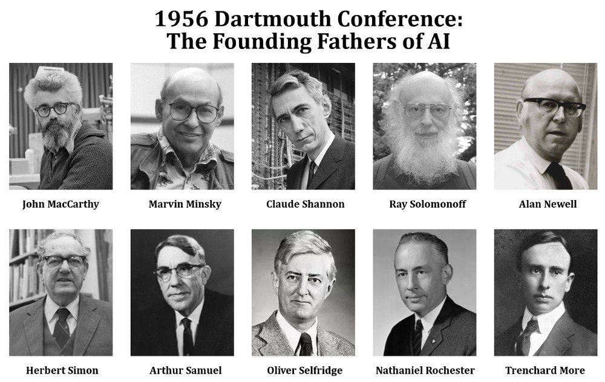]]

---
# 1957 感知机模型

.center[.width-80[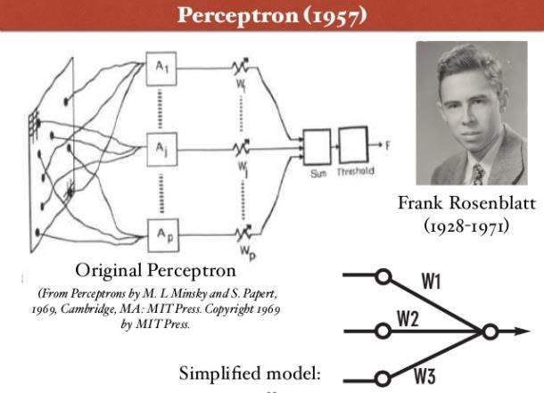]]
* 进展不错
  * Marvin Minsky1967年预言：AI在一代人内就可以被解决

???

ELIZA对话机器人

.center[.width-100[]]
???
http://blog.sciencenet.cn/blog-77605-446185.html
---
# ELIZA对话机器人

一位女士对ELIZA进行早期测试时的部分交谈内容：
.smaller[
- 机：有什么麻烦吗？
- 人：天下的男人都很相似。
- 机：怎么相似的？
- 人：他们总是会用这样那样的事情烦扰我们。
- 机：你能举个实例吗？
- 人：嗯，我男朋友让我产生这样的想法。
- 机：你男朋友让你这么想的啊。
- 人：他说我大部分时间都情绪低落。
- 机：听到你说情绪低落，我很难过。
- 人：是这样的，我不快乐。
- 机：你能解释一下什么让你不快乐吗？
]

???
魏泽鲍姆在1966年1月发表的一篇论文中介绍了自己编写的这个程序，并举例说明它是如何工作的。如果有人输入“I am very unhappy these days”（我这些日子很不快乐）这句话，计算机只要识别“I am”这个短语通常用于描述说话者的当前情形或精神状态就可以了。计算机随后会对这句话进行改造，把它变成一句回应“How long have you been very unhappy these days”（你这些日子很不快乐有多久了）。魏泽鲍姆解释说，程序首先“对原始语句”应用“一种模板，模板中的部分内容和‘I am’这两个单词相匹配，模板中的剩余部分把‘very unhappy these days’这些单词分离出来”。然后程序使用一个算法上的“重组工具包”，按照模板格式裁剪句子内容。“任何具有‘I am BLAH’格式的句子”都会被“转换为‘How long have you been BLAH’，这种转换跟BLAH的含义无关”，这样的规则包含在程序算法当中。

魏泽鲍姆把他的软件程序命名为ELIZA，取自英国作家萧伯纳《卖花女》中的伦敦女孩伊莱扎的名字。在小说中，伊莱扎在傲慢的语言学教授亨利希金斯辅导下，学说正确的英语。为了让模拟交谈更有趣，魏泽鲍姆还给这个人工谈话者安排了一个角色——心理医生罗杰斯。根据魏泽鲍姆后来发表的文章中的解释，选择这个名字是有现实意义的。20世纪40年代，心理学家卡尔罗杰斯（Carl Rogers）开发了一套心理治疗技术。采用罗氏治疗法治疗心理疾病时，心理医生在跟病人交谈的过程中，假装自己对这个世界一无所知。在大部分情况下，他们只是简单模仿病人的说法，以开放式的陈词滥调回应病人。知道心理医师的无知是假装的之后，病人就不会把“各种各样的背景知识、深刻洞见和推理能力”归因于他们的治疗师了。魏泽鲍姆认识到，罗氏治疗法中的医师角色对ELIZA具有“至关重要的心理效用”：它表明程序的虚无性会掩盖某些真正的智能。

.center[.width-100[]]
---
# 第一个冬天：1974-1980

- 感知机模型被发现有缺陷
- 仅适用于“线性可分”的情形
  - “异或”就不行
- 第一个冬天
  - 人工智能逐渐被忽略
  - 创业、资助消失

.center[.width-40[]]
---
# 1980-1987：专家系统

- 记录专家的行为与决策
- 提取规则，建立专家系统

.center[.width-100[]]
---
# 第二个冬天：1987-1993

- 规则太复杂，很难提取和定义
  - 性能未达预期
  - 陷入低谷

.center[.width-60[]]
---
# 1993-至今

* 机器学习
* 深度学习
* 计算机视觉
* 阿尔法狗

---
class: middle, center

.center[.width-80[]]

---
# 内容

- 定义
- 历史
- .red[机器学习]
- 应用

---

# 人工智能的方法

- 机器学习
- 搜索
- 推理
  * 符号推理
  * 逻辑推理
- 统计

---
class: middle, center

# 机器学习

Arthur Samuel，1959

“让机器像人一样学习，不需要清楚的编程”

---
# 机器学习

- Tom Mitchell, 1998

- “一个适定的学习问题是：一个计算机程序，为了任务T，从经验E中学习，改进它的性能P。它在任务T上的表现（由P测量）随经验E而改善”

---
# 从历史数据中学习

- 从历史数据中学习
  - 趋势
  - 根据趋势预测

.center[.width-70[]]

---
# 从历史数据中学习

- 趋势和季节性

.center[.width-100[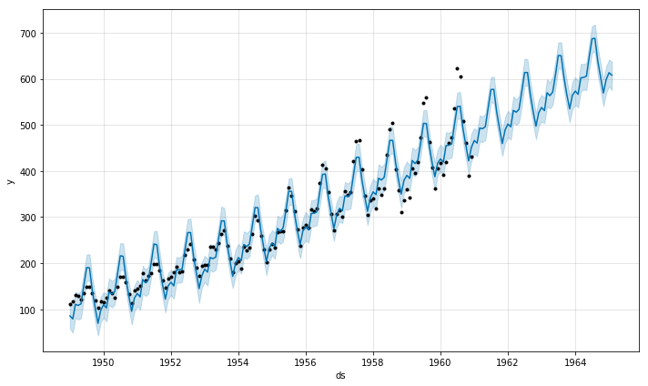]]

???

class: middle, center

# 更复杂的学习呢？
## 例：如何识别一只猫？

# 一般方法

- 定义规则
  - 猫 = “有胡须的四足动物”
- 分解为子问题
  * 找腿，而且要有四只
  * 找胡子
- 解决更细节的技术问题
  * 找边缘
  * 将猫从背景中提取出来：背景分离

# 机器学习方法

* 不需给出“什么是猫”的清晰的规则
* 像教儿童学习一样
  * 给计算机很多猫的图片，也给很多不是猫的图片（狗、汽车、...）的图片
  * 计算机从这些数据中，自己学出来什么是“猫”
* 需要更高级的算法
  * 深度学习
* 效果
  * 比人的识别准确度都要高

---
class: middle, center

# 八种机器学习任务

---
class: middle, center

# 1）回归

Regression

预测“数值”

---
# 预测房价

- 基于
  - 房间数
  - 到市中心的距离
  - 学区
  - 犯罪率

.center[.width-60[]]

---
# 线性回归

.center[.width-90[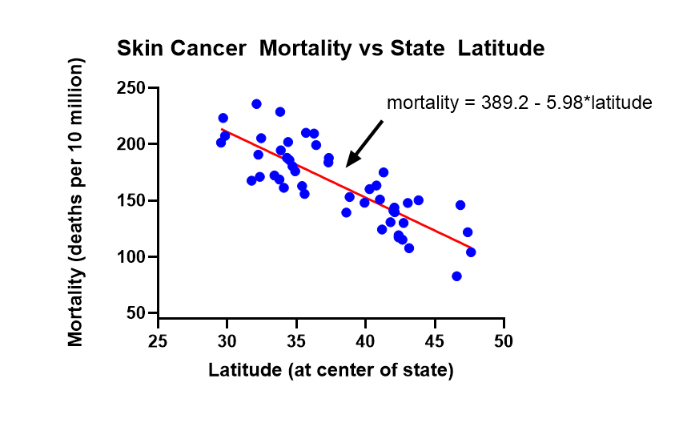]]
- $ y = ax + b $, $a$ 和 $b$ 是模型参数
- 根据数据学习$a$和$b$

---
# 非线性回归

.center[.width-80[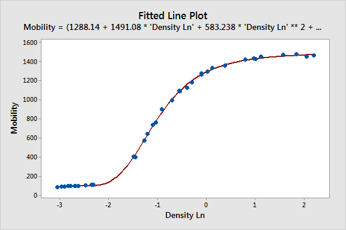]]

- $ y = ax + bx^2 + cx^3 $, $a, b, c$ 是模型参数
- 根据数据学习 $a，b，c$

---
# 比较

- 线性回归：直线
- 非线性回归：曲线
.center[.width-80[]]

---
# 讨论

- 您想到什么回归任务？
- 有哪些相关因素？
- 线性模型还是非线性模型？

.center[.width-60[]]

???
# 股价预测
茅台股价和平均目标价

.center[.width-100[]]

---
class: middle, center

# 机器学习模型的性能

数据 + 模型 + 经验

---
class: middle, center
# 1）数据
好的数据是成功的关键
---
# 数据量对结果的影响
数据量少，模型误差大
.center[.width-100[]]
---
# 数据量对结果的影响
随着数据量增长，模型误差减少
.center[.width-100[]]
---
# 数据量对结果的影响
随着数据量增长，模型误差减少
.center[.width-100[]]
---
# 数据量对结果的影响
随着数据量增长，模型误差减少
.center[.width-100[]]
---
# 数据量对结果的影响
随着数据量增长，模型误差减少
.center[.width-100[]]
---
# 数据量对结果的影响
随着数据量增长，模型误差减少
.center[.width-100[]]
---
class: middle, center
# 2）模型

模型选择非常重要
---
# 模型能力
模型能力不够，欠拟合
.center[.width-100[]]
---
# 模型能力
模型能力不够，欠拟合
.center[.width-100[]]
---
# 模型能力
模型能力适中
.center[.width-100[]]
---
# 模型能力
模型能力适中
.center[.width-100[]]
---
# 模型能力
模型能力适中
.center[.width-100[]]
---
# 模型能力
模型能力太强，过拟合
.center[.width-100[]]
---
# 模型能力
- 训练集上，模型错误随模型能力增长一直下降
- 但最后的下降，是过拟合了
.center[.width-90[]]
---
# 过拟合
- 过拟合导致模型在测试集上错误上升
.center[.width-100[]]
---
# 模型能力
选择合适的模型非常重要

.center[.width-100[]]
---
# 模型选择

* 深度神经网络不是唯一的机器学习算法
* 完全可以基于干净的数据集、更简单的算法（如线性回归）来解决问题
* 记住奥卡姆剃刀准则
---
class: middle, center

# 奥卡姆剃刀准则

简约至上

“The explanation requiring the fewest assumptions is most likely to be correct”

"解释能力相同情况下，假设越少越好”
---
# 奥卡姆剃刀

- Occam’s Razor
- 14世纪逻辑学家，奥卡姆的威廉（William of Occam）提出
- “切勿浪费较多东西，去做‘用较少的东西，同样可以做好的事情’
---
# 奥卡姆剃刀

- 关于同一个问题有许多种理论，每一种都能作出同样准确的预言，那么挑选其中使用假定最少的
- 尽管越复杂的方法通常能做出越好的预言，但是在不考虑预言能力（即结果大致相同）的情况下，假设越少越好
- 在结果大致相同的情况下，模型越简单越好

???
简约之法则，是由14世纪逻辑学家、圣方济各会修士奥卡姆的威廉（William of Occam，约1287年至1347年，奥卡姆（Ockham）位于英格兰的萨里郡）提出的一个解决问题的法则，他在《箴言书注》2卷15题说“切勿浪费较多东西，去做‘用较少的东西，同样可以做好的事情’。”换一种说法，如果关于同一个问题有许多种理论，每一种都能作出同样准确的预言，那么应该挑选其中使用假定最少的。尽管越复杂的方法通常能做出越好的预言，但是在不考虑预言能力（即结果大致相同）的情况下，假设越少越好。

---
class: middle, center
# 2）经验

经验非常重要

---
# 对问题和数据的理解

- 预测房价
  - 房间数
  - 到市中心的距离
  - 学区
  - 犯罪率

.center[.width-40[]]

---
class: middle, center

# 2）分类

Classification

学习“类别”

---
# 基于值的分类

- 冷还是热?
.center[.width-80[]]
.center[基于门限的判断: $x > 60$F ?]

---
# 垃圾邮件分类

* 邮件特征
  * 发件时间
  * 发件人
  * 敏感词
* 结果
  * 是否垃圾邮件

.center[.width-30[]]

---
# 人脑神经元模型
* 神经元（脑细胞）通过突触连接
* 大脑不断创造，增强和削弱这些联系

.center[.width-60[]]

---
# 感知器模型I
- 输入的线性加权总和
  - 神经元输入：$ x_i $
  - 连接权重：$ w_i $
  - 总和：$ w_1 x_1 + w_2 x_2 + b $

.center[.width-40[]]
---
# 感知器模型II
- 非线性激活函数
.center[.width-90[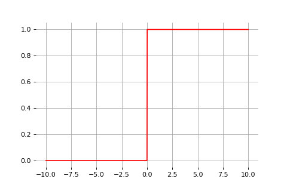]]
.center[$\sigma(x): x \geq 0$]
---
# 感知器模型
- 输入线性加权总和
- 非线性激活函数 
 
.center[.width-80[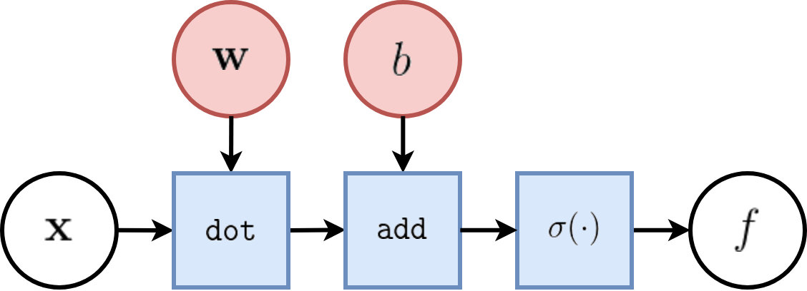]]
$$ f(x): w_1 x_1 + w_2 x_2 + b \geq 0 $$
---
# 感知器分类
- 线性分割

.center[.width-80[]]
$$ w_1 x_1 + w_2 x_2 + b \geq 0 $$

---
# 实现

.center[.width-100[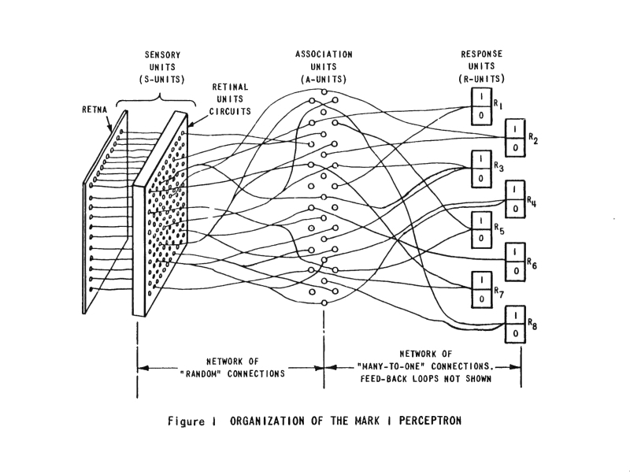]]

---
# 实现
.center[.width-60[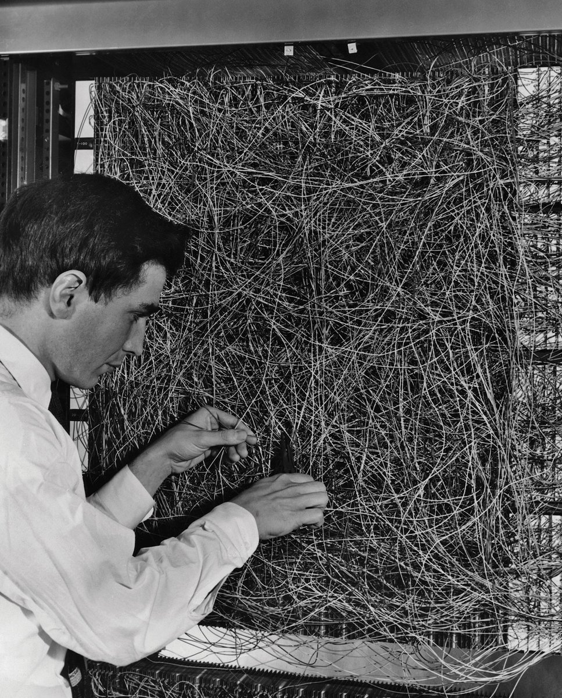]]
---
class: middle, center
# 模型训练方法
从错误中学习

???
* 涉及到一点代数和向量的知识
* 简单的例子:
  * 把一个直角坐标系里画满数据的坐标，然后在上面放上一个指针，这个指针的位置是会根据数据的对或者错更改位置的，这也是人工智能的本质。
---
# 人脑学习过程
* 根据实验结果不断创建，加强和削弱神经元之间的连接
  * 即 .red[调整连接的权重：$w$]

.center[.width-60[]]
---
# 机器学习过程
- 发生错误，向后调整模型参数$ w $
 
 
.center[.width-100[]]
---
# 感知器学习过程
- 查找错误，调整权重$ w $以减少错误
$$ w_1 x_1 + w_2 x_2 + b \geq 0 $$
.center[.width-70[]]
---
# 感知器学习过程
- 调整$ w $ <=>调整决策边界
 

.center[.width-80[]]
$$ y = \sigma (w_1 x_1 + w_2 x_2 + b) $$
---
# SVM
- 支持向量机
  - 调整决策边界。不仅避免错误，双方越远越好

.center[.width-70[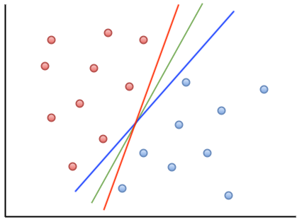]]

???
SVM: Support-vector machine
$$ y (\vec{w} * \vec{x} - b ) \geq 1$$
<!-- .center[.width-100[]] -->

---
# 前向神经元网络

<!-- Input layer, hidden layer, output layer -->

 
.center[.width-70[]]

.center[隐藏和输出层单位：*感知机*]

---
# 深度神经网络
 
.center[.width-100[]]
.center[多个隐藏层]
---
# 深度的好处
通常，模型越深，越强大
 
 
.center[.width-100[]]
---
# FNN实验
- 基于浏览器的TensorFlow实验
- http://playground.tensorflow.org

.center[.width-90[]]

---
class: middle, center

# 更多文本分类示例

### 情感分类

### 自动答案
---
# 评论分类

- 正面或负面

.center[.width-100[]]

???
[IMDB用户评论](https://www.imdb.com/title/tt6751668/reviews?ref_=tt_ql_3)

[数据集](https://ai.stanford.edu/~amaas/data/sentiment/)

---
# 自动问答

- 斯坦福问答数据集（SQuAD）
  - 阅读理解数据集
  - 人群工作者在Wikipedia文章上提出的问题
  - 答案是阅读段落中的一段文字或跨度，或者可能无法回答。
- 分类问题
  - .red[这个词是答案吗？]

[SQuAD网站](https://rajpurkar.github.io/SQuAD-explorer/)

---
# 数据

- 文字
  - 特斯拉（Tesla）在电话和电气工程方面积累了丰富的经验，然后于.red [1884]移居美国，在纽约的Thomas Edison工作。不久，他就靠金融支持者独自出击，成立了实验室和公司来开发各种电气设备。
-  题
  - 尼古拉·特斯拉是哪一年移民到美国的？
- 回答
  - 1884年

---
# 深度学习文本模型

.center[.width-110[]]
.center[IMDB情感分类: BERT 93.46%]

???
# SQUAD的BERT

.center[.width-60[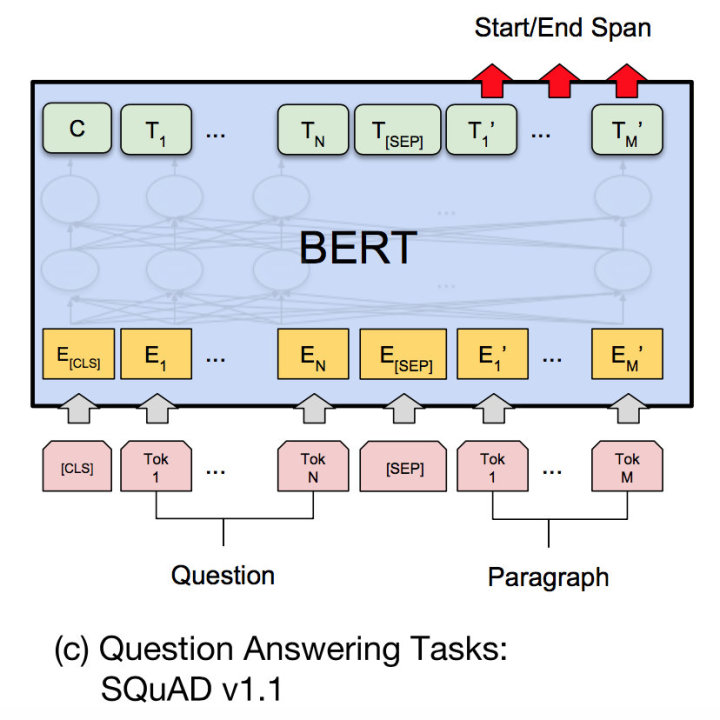]]

.center[BERT: 88.5%]

---
# 小结

- 分类是要学习“类别”
  - 猫 🐱 狗🐶
  - 是否垃圾邮件
- 您工作中有分类任务吗？
  - 请分享？

---
# 分类指标

- 真阴（TN）
- 假阳（FP）
- 假阴（FN）
- 真阳（TP）

---
# 混淆矩阵

<!-- .center[.width-50[]] -->

.center[.width-90[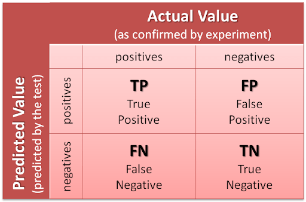]]

---
# 例

.center[.width-100[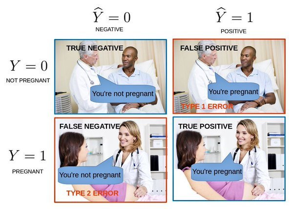]]

---
# 讨论

- 当我们预测某人为阳性，验血结果确实为阳性时
  - 正阳（TP）还是假阳（FP）？
- 当我们预测某人为阳性，但验血实际结果为阴性时
  - ？

---
# 小结

- 回顾
  - 分类：预测.red[类别]标签
  - 回归：预测.red[数字]标签
- 讨论：天气预报
  - *分类*或*回归*？
  - 向上或向下预测
  - 预测温度

???

分类性能评估
- True Negative: 真阴
- False Positive：假阳
- False Negative：假阴
- True Positive：真阳

.center[.width-50[]]

# 分类：图片分类（ImageNet）

.center[.width-90[]]

???
# 分类：图片分类（ImageNet）

.center[.width-90[]]

---
class: middle, center

# 3）排序

Ranking

---
# 排序
- 排序选项以找到最相关的结果
- 信息检索的核心部分
  - 文件检索
  - 在线广告
.center[.width-50[]]

---
# 搜索排序
.center[.width-100[]]
---
# 排序考虑因素（谷歌2016年）
- 超链接：29％
- 定期制作、原创、“思想领袖”的内容：23％
- 元页面、标题、标签中的关键字：8％
- 手机和平板上的响应速度：8％
- 有针对转换优化的着陆页：8％
- 干净的代码：6％
- 网站访问速度：5％
- 社会网络中的热度：4％
- 网址年龄：4％

???
https://firstpagesage.com/seo-blog/seo-basics/2016-guide-google-algorithm-ranking-factors/
https://optinmonster.com/seo-ranking-factors/
---
# 网页排名（PageRank算法）

- 随机访问所有超链接，进入页面的可能性
- 衡量网页的重要性

.center[.width-70[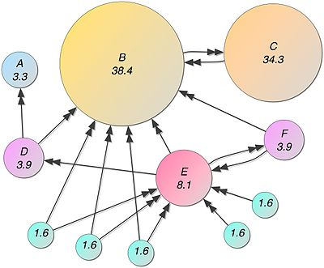]]

---
class: middle, center

# 4）推荐
---
# 产品推荐

.center[.width-100[]]
---
# 新闻推荐

.center[.width-70[]]

---
# 巨大的商机

- 个性化的产品推荐可显着提高AOV（平均订单价值）
  - Saleforce：将商品添加到购物车的可能性提高4.5倍

.center[.width-90[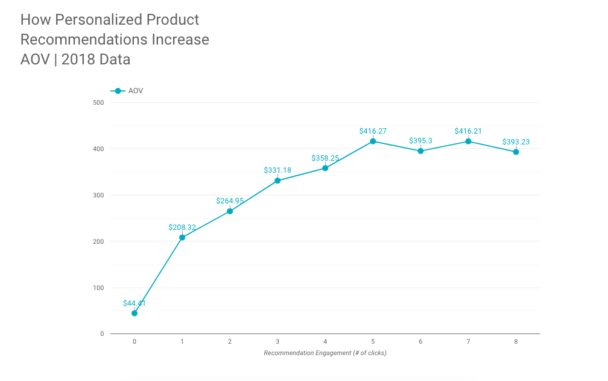]]

???
This number multiplies by 369% when prospects engage with a single recommendation. The effect continues to climb until tapering off around 5 clicks.

Value

- Saleforce
  - Shoppers that clicked on recommendations are 4.5x more likely to add items to cart
  - 4.5x more likely to complete their purchase.

---
# 基于内容的推荐

.center[.width-80[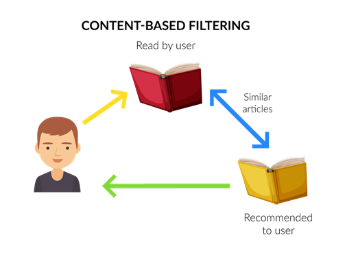]]

---
# 新闻推荐

.center[.width-90[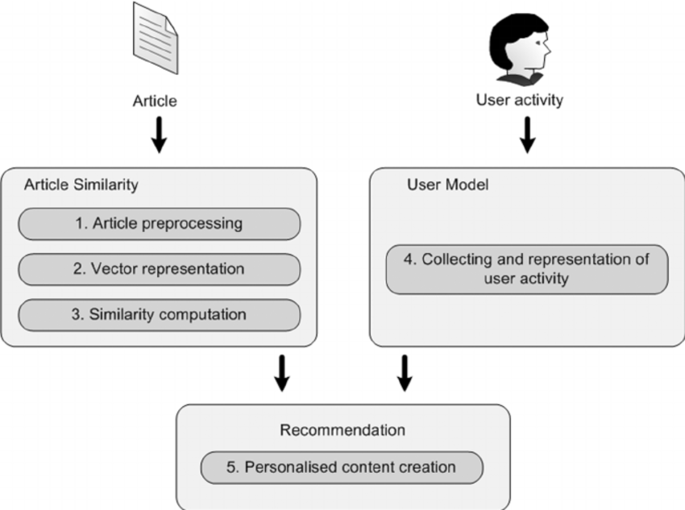]]
---
# 推荐：合作过滤

- Collaborative Filtering
- 基于用户
  * 找到兴趣相同的人，他喜欢的，推荐给你
- 基于物品
  * 找到用户喜欢分布相近的东西，推荐给你

???
沃尔玛超市会发现一个很有趣的现象：货架上啤酒与尿布竟然放在一起售卖，这看似两者毫不相关的东西，为什么会放在一起售卖呢？ 原来，在美国，妇女们经常会嘱咐她们的丈夫下班以后给孩子买一点尿布回来，而丈夫在买完尿布后，大都会顺手买回一瓶自己爱喝的啤酒（由此看出美国人爱喝酒）。商家通过对一年多的原始交易记录进行详细的分析，发现了这对神奇的组合。于是就毫不犹豫地将尿布与啤酒摆放在一起售卖，通过它们的关联性，互相促进销售。“啤酒与尿布”的故事一度是营销界的神话。那么问题来了，商家是如何发现啤酒与尿布两者之间的关联性呢？这里就用到了数据挖掘的技术，准确的说是数据挖掘中的关联规则挖掘。大致意思就是从大量数据中找出某两个对象（暂且称为X，Y）的关联性。

---
# Netflix 一百万美元大奖

- 提高评分预测的准确性

.center[.width-100[]]

---
# Netflix 1M Prize

- 高度参与的研究社区

.center[.width-100[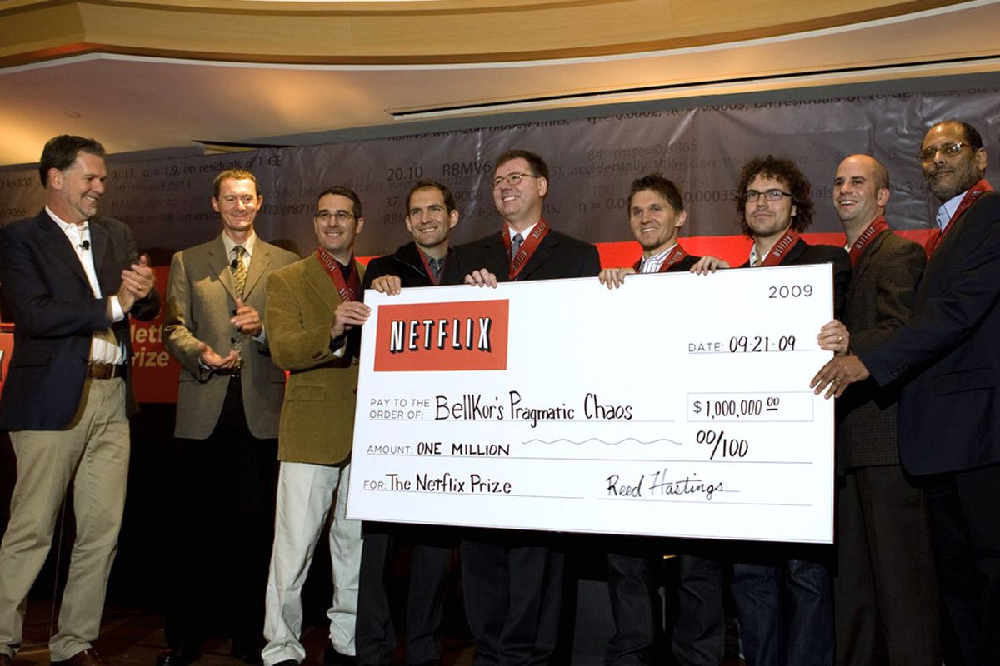]]

---
# 评估标准

- 点击率
- CTR = No. of Clicks/No. of Impressions

.center[.width-80[]]

---
# 讨论

- 基于用户还是基于项目的协作过滤？
  * 寻找与您兴趣相似的人，向您推荐他的最爱
  * 查找与您喜欢的电影相似的电影，并向您推荐

---
class: middle, center

# 5）聚类
物以类聚
---
# 聚类

.center[将聚在一起的样本，作为一类]

.center[.width-100[]]
---
# 聚类

需要指定类的数目：3

.center[.width-110[]]

---
# K-Means聚类方法

- 随机初始化每一类的质心
- 重复直到收敛
  - 将数据点分配给最近的质心
  - 重新计算质心

.center[.width-100[]]
---
# K-Means 聚类方法

.center[.width-70[]]

---
# 聚类结果的理解

- 聚类后​​，观察每个聚类以获得其含义
  - 结果可能如下所示：

.center[.width-80[]]

---
class: middle, center

# 6）表征

将复杂数据，用数学向量表示

---
# 单词表示

单词位置表明其含义

.center[.width-100[]]
---
# 单词表示

两个词之间的距离向量表示它们的语义关系
- 性别关系
- 单数和复数关系

.center[.width-100[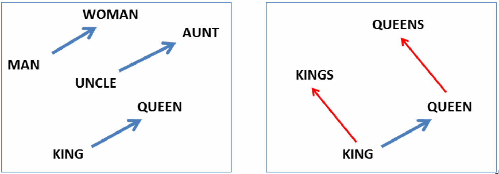]]

---
# 文档表征

- 找到相似的文档
  - 抄袭检测

.center[.width-100[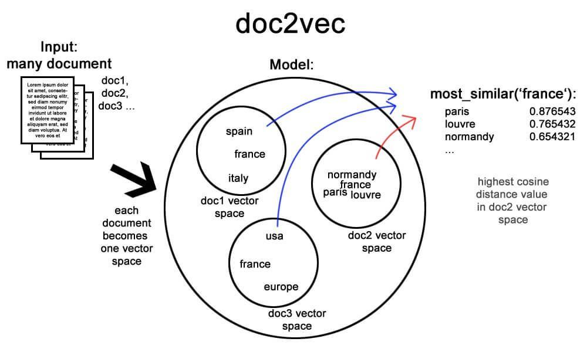]]

---
# 图像表征
图片位置表示了它们的内容

.center[.width-50[]]

.center[MNIST 0-9数字图片，表征后聚成10个簇]

---
class: middle, center

# 7）结构化预测

利用结构化信息

---
# 结构化数据

- 数据由几部分组成
  - 各部分之间有关系
- 文本、图片、文档有关系

.center[.width-100[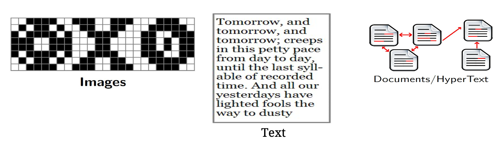]]

---
# 语音识别
- 下一个词和前面的词有很强的关系
- 因此，可以利用前面的单词，预测后面的单词

.center[.width-80[]]

---
# 人机对话

.center[.width-100[]]
---
# 自动翻译

<!-- .center[
<video width="600" controls>
    <source src="./video/asr.mp4" type="video/mp4">
</video>
] -->

视频

---
class: middle, center

# 8) 增强学习

Learning based on the rewards received
---
# 基于回报的学习

- 目标: 最大化回报

.center[.width-80[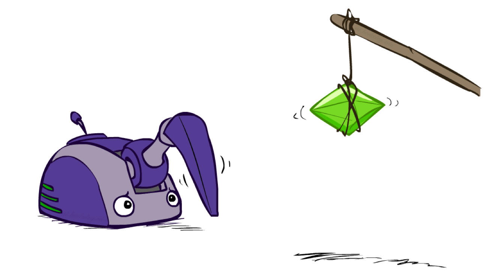]]
---
# 增强学习

- 进行大量尝试
- 跳进火坑也不怕

.center[.width-70[]]
---
# 增强学习

- 不断尝试
- 得到每一个位置的“价值”
- 或者每一个位置下的最佳动作

.center[.width-70[]]

---
# 小结：八种机器学习任务

1. 分类
1. 回归
1. 排序
1. 推荐
1. 聚类
1. 表征
1. 结构化预测
1. 增强学习

---
# 内容

- 定义
- 历史
- 机器学习
- .red[应用]

???
class: middle, center

---
class: middle, center
# 游戏
.center[.width-100[]]
---
class: middle, center
# Atari
<!-- <video width="400" controls>
    <source src="./video/atari.mp4" type="video/mp4">
</video> -->

视频

---
# Atari
增强学习值函数

.center[.width-100[]]
---
# AlphaGo
.center[.width-100[]]
---
class: middle, center
# AlphaGo

视频

---
class: middle, center

# Game

Video: OpenAI Dota

---
class: middle, center
# Walk

Video: DeepMind Walk

---
class: middle, center

# Robot

Video: RoboCup 2018

---
# 小结

- 定义
  - 人工智能
  - 机器学习
- 历史
  - 三次浪潮，两次寒冬
- 机器学习
  - 八种
- 应用和创新
  - 视觉、语言、文本

---
# 小测验
- 什么是人工智能
- 什么是机器学习
- 预测明天的股票是涨还是跌，是分类还是回归问题？
- 预测明天的茅台股价多少钱，是分类还是回归问题？
- 人工智能从诞生起就一帆风顺，这一说法对吗？