class: middle, center

### 大数据时代下人工智能技术的应用与创新

# 人工智能

陈一帅

.smaller[[yschen@bjtu.edu.cn](mailto:yschen@bjtu.edu.cn)]

.smaller[网络智能实验室]

.smaller[北京交通大学电子信息工程学院]

.footnote[呼局中青班]
---
# 内容

- 定义
- 应用类型
- 火热和寒冬
- 应用和创新

---
# 内容

- .red[定义]
- 应用类型
- 火热和寒冬
- 应用和创新

---
class: middle, center

# 人工智能

AI：Artificial Intelligence

使计算机像人那样聪明

???

---
# 智能

- 理解：文字、视觉
- 交流：文字、语音
- 计划：设计、规划
- 学习：知识、模仿
---
# 图灵测试（1）

让人认为是在和人对话

.smaller[
- 问：请以“福斯桥”(Forth Bridge)为主题写一首十四行诗。
- 答：我不会回答这道题，我从来没有写过诗。
- 问：34 957 加70 764 等于多少?
- 答：(在经过大概30 秒之后给出答案)105 621。
- 问：你会下象棋吗?
- 答：会的。
- 问：我在K1 处有棋子K，而且没有其他棋子。你在K6 处有棋子K，在R1 处有棋子R。现在轮到你了，你要下哪一步棋?
- 答：(在经过15 秒之后)棋子R 走到R8 处，将军。
]
---
# 图灵测试（2）

让人认为是在和人对话

.smaller[
- 问：14行诗的首行是 “你如同夏日”，你不觉得“春日”更好吗？
- 答：它不合韵。
- 问：“冬日”如何？它可是完全和韵的。
- 答：它确是合韵的，但没有人愿意被比作“冬日”。
- 问：你不是说过匹克威克先生让你想起圣诞节吗？
- 答：是的。
- 问：圣诞节是冬天的一个日子，我想匹克威克先生对这个比喻不会介意吧。
- 答：我认为您不够严谨，“冬日”指的是一般冬天的日子，而不是某个特别的日子，如圣诞节。
]
---
# 技术

- 机器学习
- 搜索
- 推理
  * 符号推理
  * 逻辑推理
- 统计

---
class: middle, center

# 机器学习

Arthur Samuel，1959

“让机器像人一样学习，不需要清楚的编程”

---
# 机器学习

- Tom Mitchell, 1998

- “一个适定的学习问题是：一个计算机程序，为了任务T，从经验E中学习，改进它的性能P。它在任务T上的表现（由P测量）随经验E而改善”

---
class: middle, center

# 例：如何识别一只猫？

---
# 一般方法

- 定义规则
  - 猫 = “有胡须的四足动物”
- 分解为子问题
  * 找腿，而且要有四只
  * 找胡子
- 解决更细节的技术问题
  * 找边缘
  * 将猫从背景中提取出来：背景分离
---
# 机器学习方法

* 不需给出“什么是猫”的清晰的规则
* 像教儿童学习一样
  * 给计算机很多猫的图片，也给很多不是猫的图片（狗、汽车、...）的图片
  * 计算机从这些数据中，自己学出来什么是“猫”
* 效果
  * 比人的识别准确度都要高

---
# 机器学习的经典实现方法

* 特征提取
* 机器学习

.center[.width-100[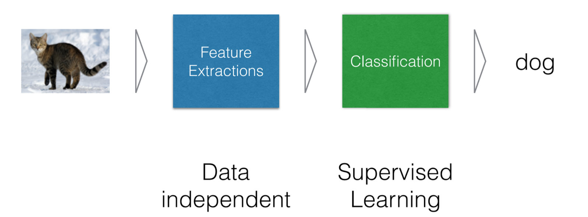]]
---
# 内容

- 定义
- .red[应用类型]
- 火热和寒冬
- 应用和创新

---
class: middle, center

# 八种学习任务
---
class: middle, center

# 1）分类

Classification

学习“类别”
---
# 分类：图片分类（ImageNet）

.center[.width-90[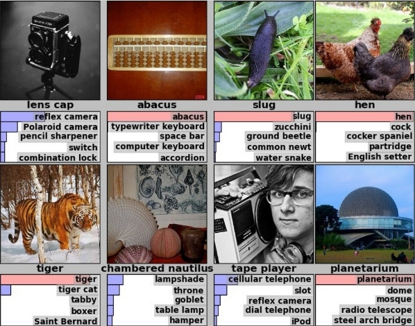]]

???
# 分类：图片分类（ImageNet）

.center[.width-90[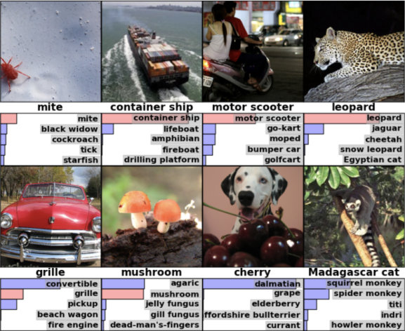]]

分类：文本分类

- 垃圾邮件分类
* 邮件特征
  * 发件时间
  * 发件人
  * 敏感词
* 结果
  * 是否垃圾邮件

???

分类性能评估
- True Negative: 真阴
- False Positive：假阳
- False Negative：假阴
- True Positive：真阳

.center[.width-50[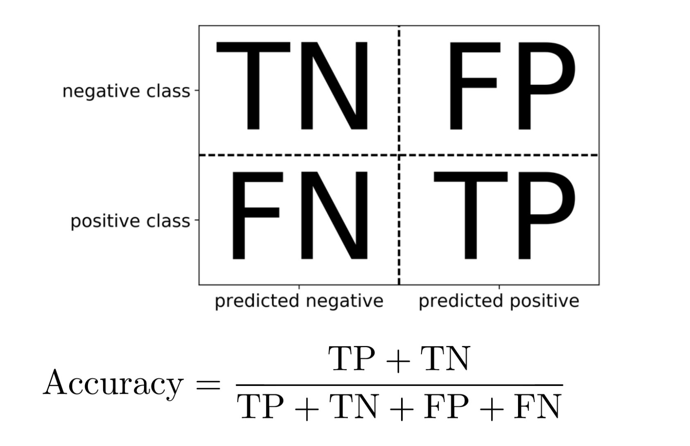]]
---
class: middle, center

# 2）回归

Regression

学习“数值”
---
# 股价预测
茅台股价和平均目标价

.center[.width-100[]]

.center[预测涨跌，分类；预测股价，回归]

---
# 线性回归与非线性回归
直线：线性回归；曲线：非线性回归
.center[.width-100[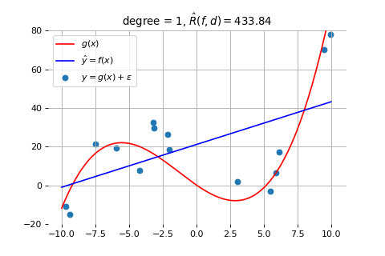]]

---
# 讨论：分类与回归的区别

- 例：预测气温
  - 预测明天是“热”还是“冷”：分类
  - 预测明天气温多少度：回归

<!-- 按照最近几天的温度来预测明天的温度。 -->

.center[.width-70[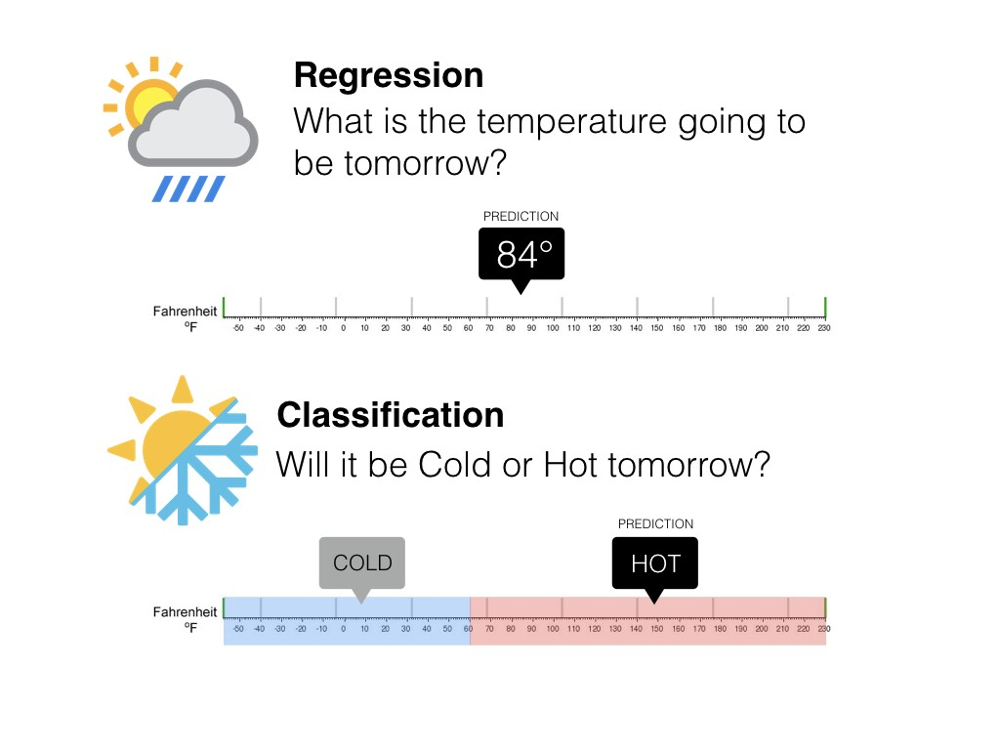]]

---
class: middle, center

# 3）排序

Ranking
---
# 搜索排序
.center[.width-100[]]
---
# 排序考虑因素（谷歌2016年）
- 超链接：29％
- 定期制作、原创、“思想领袖”的内容：23％
- 元页面、标题、标签中的关键字：8％
- 手机和平板上的响应速度：8％
- 有针对转换优化的着陆页：8％
- 干净的代码：6％
- 网站访问速度：5％
- 社会网络中的热度：4％
- 网址年龄：4％

???
https://firstpagesage.com/seo-blog/seo-basics/2016-guide-google-algorithm-ranking-factors/
https://optinmonster.com/seo-ranking-factors/
---
class: middle, center

# 4）推荐
---
# 推荐：淘宝

.center[.width-100[]]
---
# 推荐：头条

.center[.width-70[]]
---
# 推荐：合作过滤

- Collaborative Filtering
- 基于用户
  * 找到兴趣相同的人，他喜欢的，推荐给你
- 基于物品
  * 找到用户喜欢分布相近的东西，推荐给你

???
沃尔玛超市会发现一个很有趣的现象：货架上啤酒与尿布竟然放在一起售卖，这看似两者毫不相关的东西，为什么会放在一起售卖呢？ 原来，在美国，妇女们经常会嘱咐她们的丈夫下班以后给孩子买一点尿布回来，而丈夫在买完尿布后，大都会顺手买回一瓶自己爱喝的啤酒（由此看出美国人爱喝酒）。商家通过对一年多的原始交易记录进行详细的分析，发现了这对神奇的组合。于是就毫不犹豫地将尿布与啤酒摆放在一起售卖，通过它们的关联性，互相促进销售。“啤酒与尿布”的故事一度是营销界的神话。那么问题来了，商家是如何发现啤酒与尿布两者之间的关联性呢？这里就用到了数据挖掘的技术，准确的说是数据挖掘中的关联规则挖掘。大致意思就是从大量数据中找出某两个对象（暂且称为X，Y）的关联性。

---
class: middle, center

# 5）聚类
物以类聚
---
# 聚类

.center[将聚在一起的样本，作为一类]

.center[.width-100[]]
---
# 聚类

需要指定类的数目：3

.center[.width-110[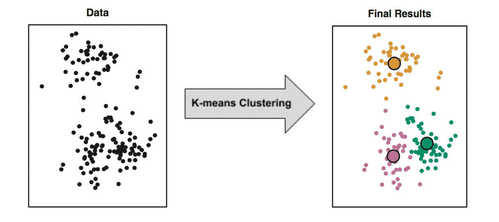]]

---
class: middle, center

# 6）表征

将复杂数据，用数学向量表示
---
# 图像表征
图片位置表示了它们的内容

.center[.width-50[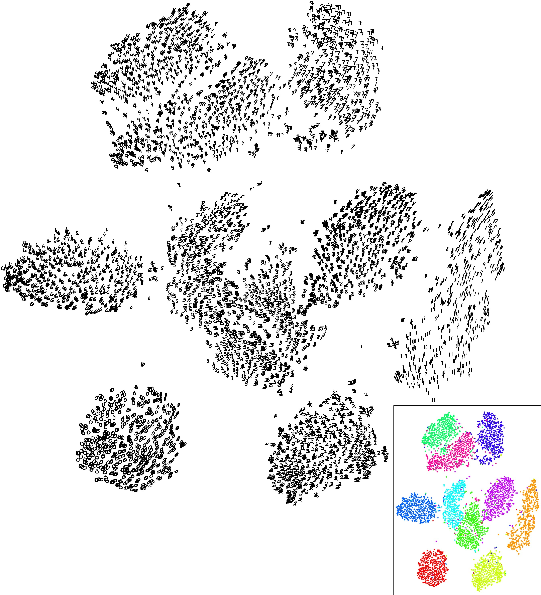]]

.center[MNIST 0-9数字图片，表征后聚成10个簇]

---
class: middle, center

# 7）结构化预测

利用结构化信息
---
# 语音识别
- 下一个词和前面的词有很强的关系
- 因此，可以利用前面的单词，预测后面的单词

.center[.width-80[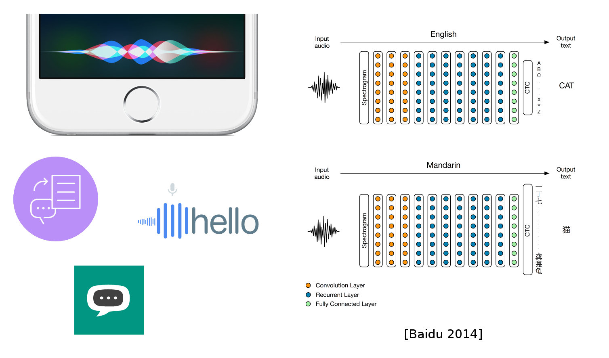]]

---
# 8）增强学习

- 进行大量尝试
- 跳进火坑也不怕

.center[.width-70[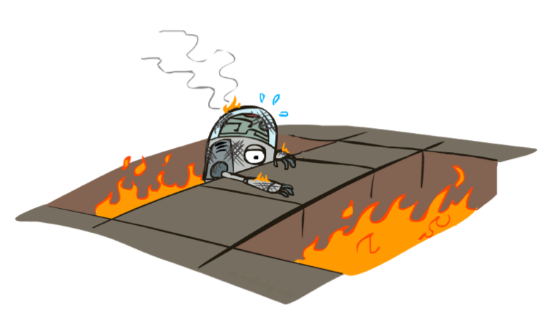]]
---
# 增强学习

- 不断尝试
- 得到每一个位置的“价值”
- 或者每一个位置下的最佳动作

.center[.width-70[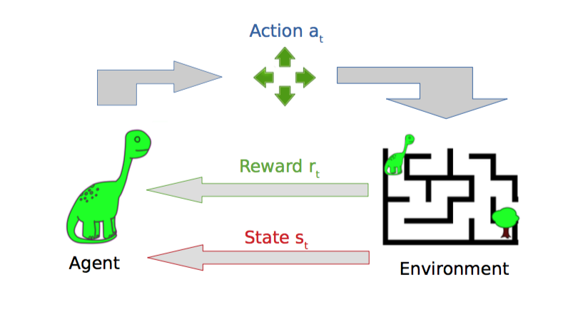]]

---
# 小结：八种机器学习任务

1. 分类
1. 回归
1. 排序
1. 推荐
1. 聚类
1. 表征
1. 结构化预测
1. 增强学习

---
# 内容

- 定义
- 应用类型
- .red[火热和寒冬]
- 应用和创新

---

class: middle, center

# 人工智能60年沉浮

1957年至今
---
# 1956-1974年：创始期

* 1956年，达特茅斯会议，提出“人工智能”这一名词
* 1957年，感知机模型
* 进展曾经不错
* Marvin Minsky1967年预言：AI在一代人内就可以被解决

???

ELIZA对话机器人

.center[.width-100[]]
???
http://blog.sciencenet.cn/blog-77605-446185.html
---
# ELIZA对话机器人

一位女士对ELIZA进行早期测试时的部分交谈内容：
.smaller[
- 机：有什么麻烦吗？
- 人：天下的男人都很相似。
- 机：怎么相似的？
- 人：他们总是会用这样那样的事情烦扰我们。
- 机：你能举个实例吗？
- 人：嗯，我男朋友让我产生这样的想法。
- 机：你男朋友让你这么想的啊。
- 人：他说我大部分时间都情绪低落。
- 机：听到你说情绪低落，我很难过。
- 人：是这样的，我不快乐。
- 机：你能解释一下什么让你不快乐吗？
]

???
魏泽鲍姆在1966年1月发表的一篇论文中介绍了自己编写的这个程序，并举例说明它是如何工作的。如果有人输入“I am very unhappy these days”（我这些日子很不快乐）这句话，计算机只要识别“I am”这个短语通常用于描述说话者的当前情形或精神状态就可以了。计算机随后会对这句话进行改造，把它变成一句回应“How long have you been very unhappy these days”（你这些日子很不快乐有多久了）。魏泽鲍姆解释说，程序首先“对原始语句”应用“一种模板，模板中的部分内容和‘I am’这两个单词相匹配，模板中的剩余部分把‘very unhappy these days’这些单词分离出来”。然后程序使用一个算法上的“重组工具包”，按照模板格式裁剪句子内容。“任何具有‘I am BLAH’格式的句子”都会被“转换为‘How long have you been BLAH’，这种转换跟BLAH的含义无关”，这样的规则包含在程序算法当中。

魏泽鲍姆把他的软件程序命名为ELIZA，取自英国作家萧伯纳《卖花女》中的伦敦女孩伊莱扎的名字。在小说中，伊莱扎在傲慢的语言学教授亨利希金斯辅导下，学说正确的英语。为了让模拟交谈更有趣，魏泽鲍姆还给这个人工谈话者安排了一个角色——心理医生罗杰斯。根据魏泽鲍姆后来发表的文章中的解释，选择这个名字是有现实意义的。20世纪40年代，心理学家卡尔罗杰斯（Carl Rogers）开发了一套心理治疗技术。采用罗氏治疗法治疗心理疾病时，心理医生在跟病人交谈的过程中，假装自己对这个世界一无所知。在大部分情况下，他们只是简单模仿病人的说法，以开放式的陈词滥调回应病人。知道心理医师的无知是假装的之后，病人就不会把“各种各样的背景知识、深刻洞见和推理能力”归因于他们的治疗师了。魏泽鲍姆认识到，罗氏治疗法中的医师角色对ELIZA具有“至关重要的心理效用”：它表明程序的虚无性会掩盖某些真正的智能。

.center[.width-100[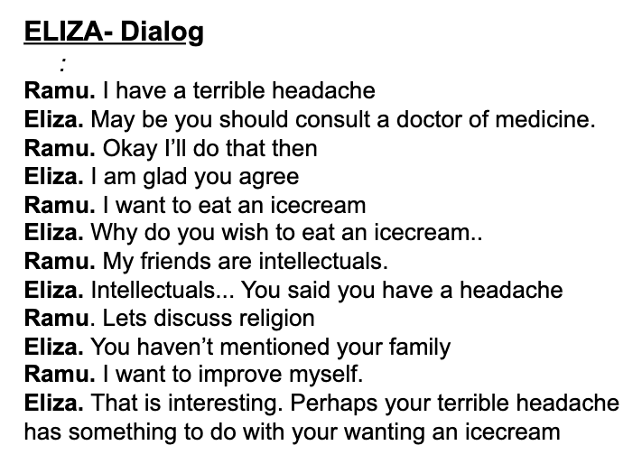]]
---
# 第一个冬天：1974-1980

- 感知机模型被发现有缺陷
- 人工智能逐渐被忽略
- 创业、资助消失

.center[.width-80[]]
---
# 1980-1987：专家系统

- 记录专家的行为与决策
- 提取规则，建立专家系统

.center[.width-100[]]
---
# 第二个冬天：1987-1993

- 性能未达预期
- 陷入低谷

.center[.width-60[]]
---
# 1993-至今

* 机器学习
* 深度学习
* 计算机视觉
* 阿尔法狗
* 最近又有衰退迹象
---
class: middle, center

.center[.width-80[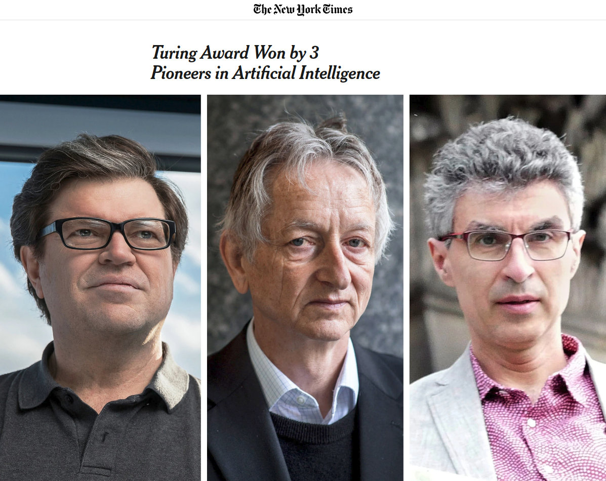]]

---
# 内容

- 定义
- 应用类型
- 火热和寒冬
- .red[应用和创新]

???
class: middle, center
# 进展

---
# 人机对话

.center[.width-100[]]

.center[利用文字的相关性]
---
class: middle, center
# 折毛巾（2010）
<!-- <video width="700" controls>
    <source src="./video/towel.mp4" type="video/mp4">
</video> -->

  <iframe src="//player.bilibili.com/player.html?aid=54907629&cid=96020505&page=1" scrolling="no" border="0" frameborder="no" framespacing="0" allowfullscreen="true"> </iframe>

---
class: middle, center
# 开车（2016）
<video width="700" controls>
    <source src="../ai/video/lec1/car-2016.mp4" type="video/mp4">
</video>
---
class: middle, center
# 分捡物体（2018）
<!-- <video width="700" controls>
    <source src="./video/waste.mp4" type="video/mp4">
</video> -->

  <iframe src="//player.bilibili.com/player.html?aid=54907070&cid=96020544&page=1" scrolling="no" border="0" frameborder="no" framespacing="0" allowfullscreen="true"> </iframe>

---
class: middle, center
# 游戏
.center[.width-100[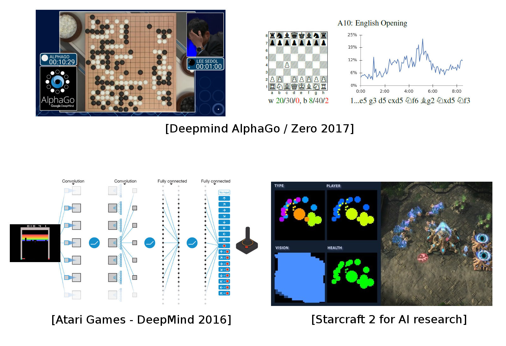]]
---
class: middle, center
# Atari
<!-- <video width="400" controls>
    <source src="./video/atari.mp4" type="video/mp4">
</video> -->

  <iframe src="//player.bilibili.com/player.html?aid=54906213&cid=96020411&page=1" scrolling="no" border="0" frameborder="no" framespacing="0" allowfullscreen="true"> </iframe>

---
# Atari
增强学习值函数

.center[.width-100[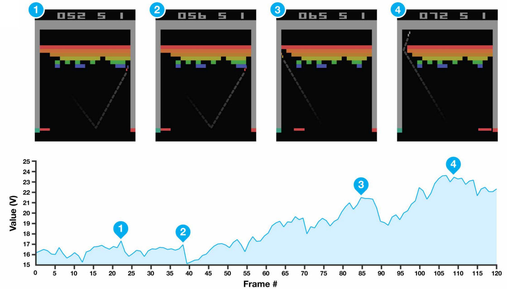]]
---
# AlphaGo
.center[.width-100[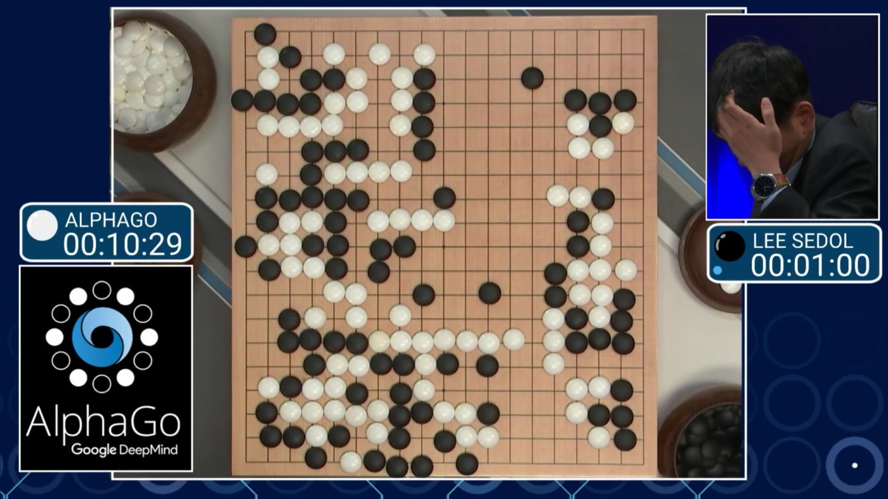]]
---
class: middle, center
# AlphaGo
<video width="600" controls>
    <source src="../ai/video/lec1/go-2016.mp4" type="video/mp4">
</video>

---
class: middle, center

# Game

Video: OpenAI Dota

---
class: middle, center
# Walk

Video: DeepMind Walk

---
class: middle, center

# Robot

Video: RoboCup 2018

---
# 小结

- 定义
  - 人工智能
  - 机器学习
- 应用类型
  - 七种
- 火热和寒冬
  - 三次浪潮，两次寒冬
- 应用和创新
  - 视觉、语言、文本

---
# 小测验
- 什么是人工智能
- 什么是机器学习
- 预测明天的股票是涨还是跌，是分类还是回归问题？
- 预测明天的茅台股价多少钱，是分类还是回归问题？
- 人工智能从诞生起就一帆风顺，这一说法对吗？