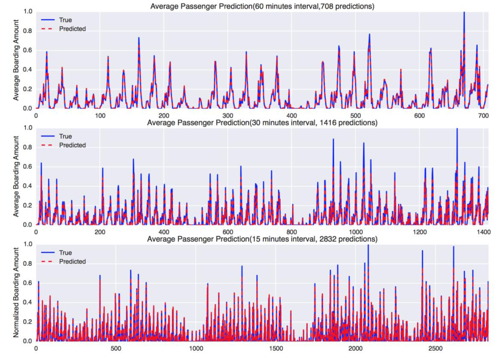
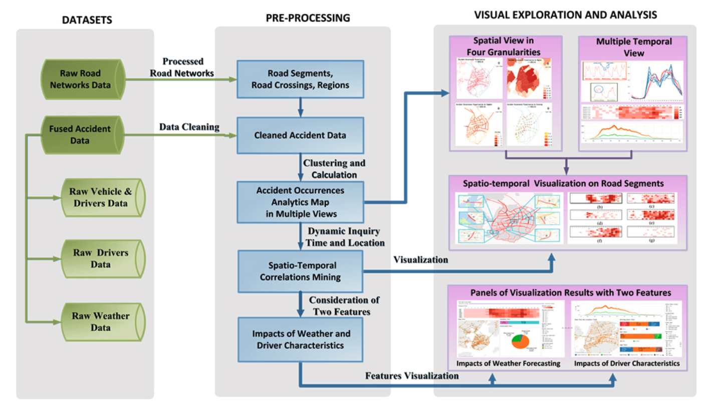
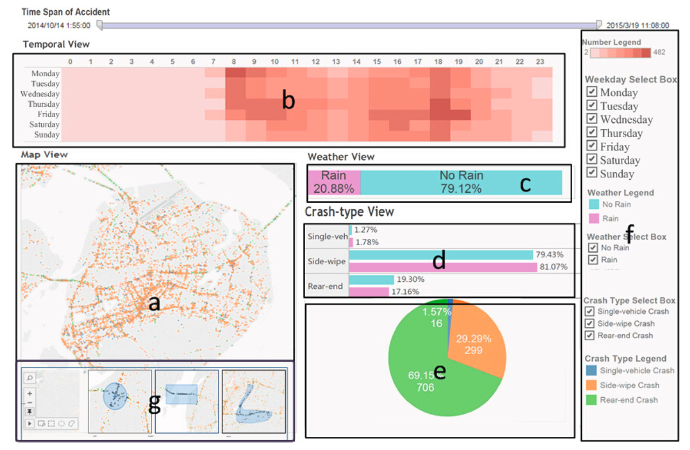
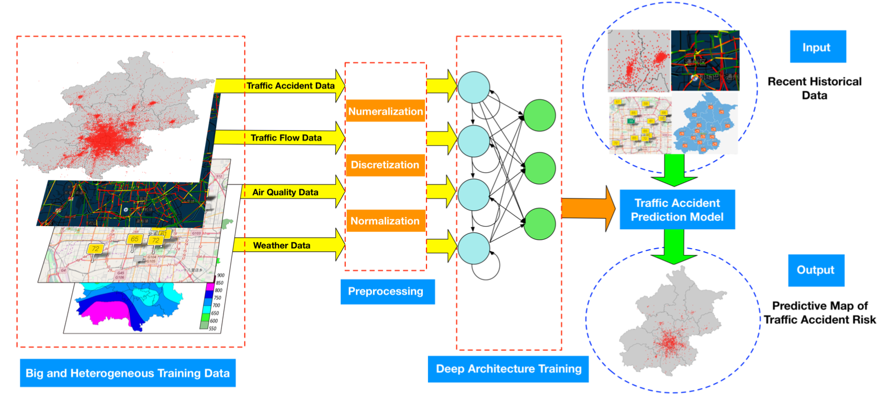
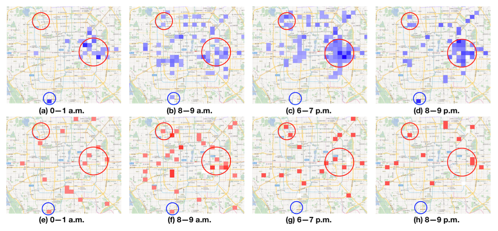
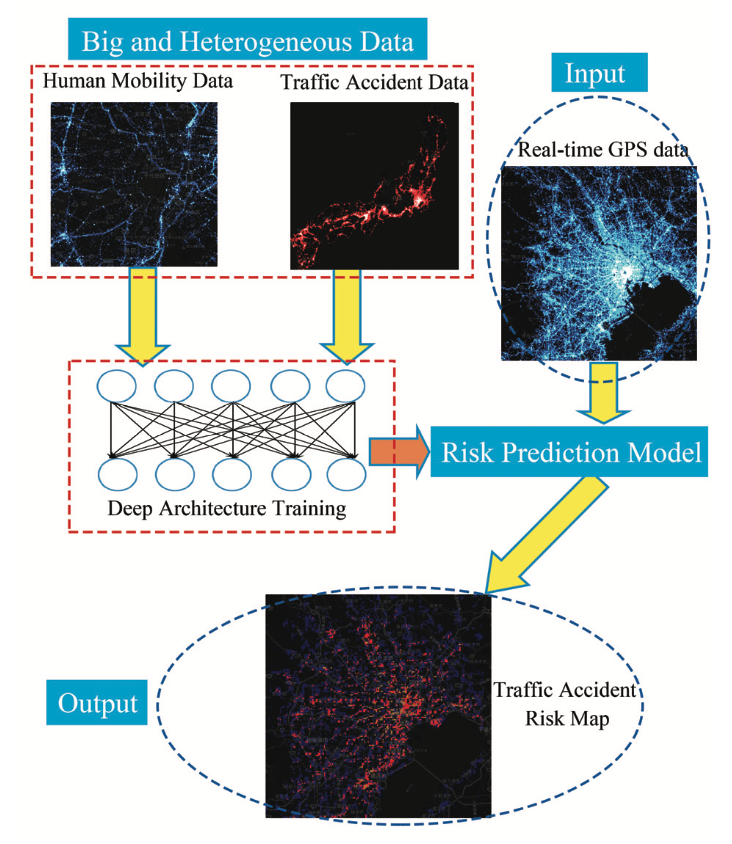

class: middle, center

### 大数据时代下人工智能技术的应用与创新

# 应用与创新（交通）

陈一帅

[yschen@bjtu.edu.cn](mailto:yschen@bjtu.edu.cn)

北京交通大学电子信息工程学院

.footnote[呼局中青班]

---
# 内容

- 交通流量分析与预测
- 事故风险分析、预测与响应

---
# 内容

- .red[交通流量分析与预测]
- 事故风险分析、预测与响应

---
# 流量分析

.center[.width-90[]]

.center[北京地铁入口流量]
.smallest[Haodong Yin, etc., Modeling and Simulating Passenger Behavior for a Station Closure in a Rail Transit Network, 2016]

---
# 流量预测

.center[.width-90[]]
.smallest[Yun Wang, Deep Learning for Bus Passenger Demand Prediction Using Big Data]

???

.smallest[Zhenzhu Wang, Yishuai Chen, Jian Su, Yuchun Guo, Yongxiang Zhao, etc. Measurement and Prediction of Regional Traffic Volume in Holidays, IEEE Intelligent Transportation Systems Conference (ITSC) 2019, pp.486-491]
魏中锐，基于深度学习的交通流量预测，硕士学位论文，2019年，导师：郭宇春

---
# 内容

- 交通流量分析与预测
- .red[事故风险分析、预测与响应]

---
# 事故信息采集和分析

.center[.width-110[]]
.center[厦门路网事故分析平台]
.smallest[Xiaoliang Fan, etc., Big Data Analytics and Visualization with Spatio-Temporal Correlations for Traffic Accidents, ICA3PP 2015]

---
# 事故信息采集和分析

.center[.width-110[]]
.center[厦门路网事故时间/地理位置信息分析]

---
# 事故风险区域预测

- 北京事故多发地区小时级预测
  - 考虑天气、时间、日期（周日/周末/假日）、车速

.center[.width-110[]]
.smallest[Honglei Ren, etc. A Deep Learning Approach to the Prediction of Short-term Traffic Accident Risk, 2017, arXiv:1710.09543v1]

---
# 事故风险区域预测

- 北京事故多发地区小时级预测结果

.center[.width-110[]]
.smallest[Honglei Ren, etc. A Deep Learning Approach to the Prediction of Short-term Traffic Accident Risk, 2017, arXiv:1710.09543v1]

---
# 事故风险路段预测

- 休斯顿路网周日下午5点-6点路段风险预测

.center[.width-90[]]
.smallest[Linhua Li, A GIS-Based Bayesian Approach For Analyzing Spatial-Temporal Patterns Of Traffic Crashes, MS Thesis, Texas A&M University, August 2006]

---
# 事故影响评估和规避

.center[.width-110[]]
.center[.smaller[（a）根据当前事故的影响计算出的路线（b）驾驶员接近事故位置时受影响区域的时变扩展（c）根据影响的准确预测计算出的路线]]
.smallest[Bei Pan, etc., Forecasting Spatiotemporal Impact of Traffic Incidents on Road Networks,
]

???
(a) route calculated based on current incident’s impact (b) time-varying expansion of impacted region as driver approaches the incident location (c) route calculated based on accurate prediction of impact

事故风险预测

.center[.width-60[]]
.center[仿真结果，考虑人流移动性]
.smallest[Quanjun Chen, etc., Learning Deep Representation from Big and Heterogeneous Data for Traffic Accident Inference, AAAI 2016]

---
# 小结

- 交通流量分析与预测
- 事故风险分析、预测与响应