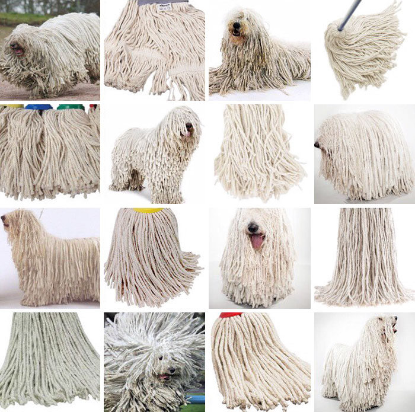
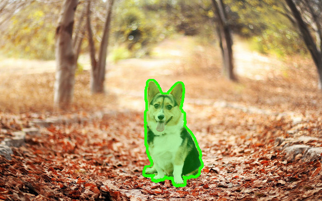
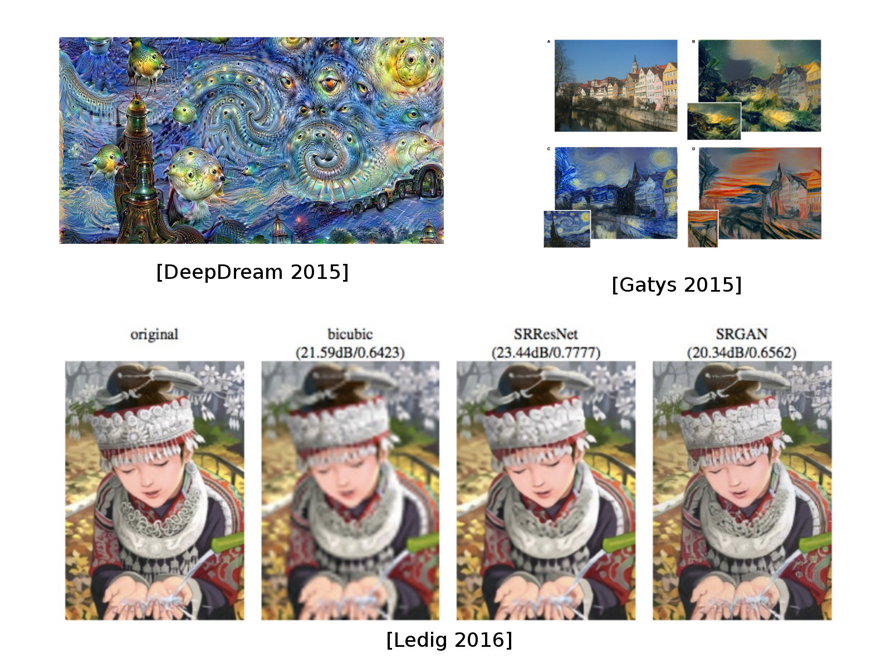
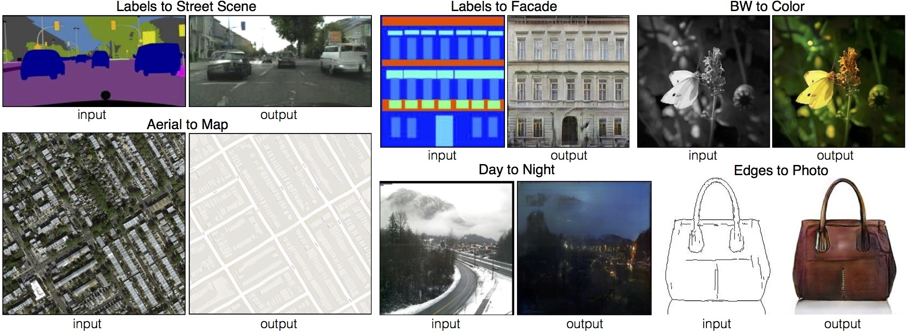
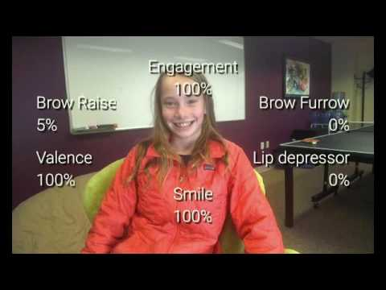
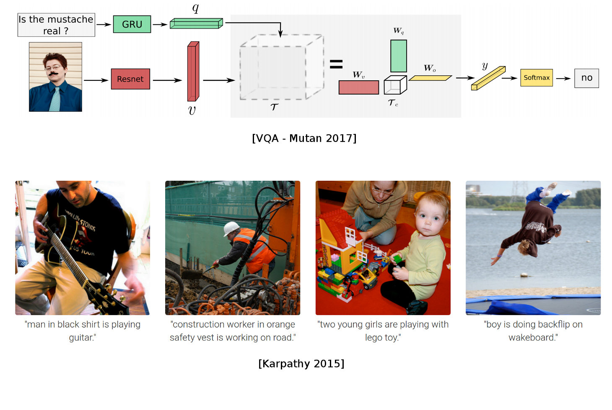
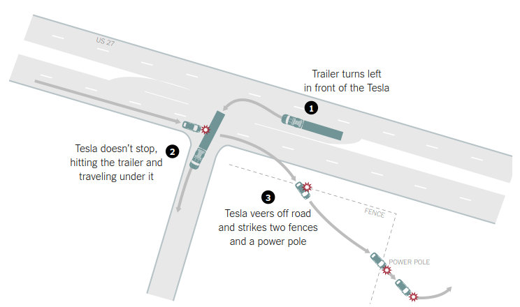

class: middle, center

#### 国铁集团铁路通信技术管理培训班

## 机器学习和人工智能

# 智能视觉

陈一帅

.smaller[[yschen@bjtu.edu.cn](mailto:yschen@bjtu.edu.cn)]

.footnote[北京交通大学网络智能实验室]
---
# 内容
- .red[背景]
- 目标检测和识别
- 图像分割
- 应用
- 应注意的问题
---
# 基本研究问题

- 目标检测、分割、识别

.center[.width-100[]]

---
class: middle, center
# 困难

遮蔽、干扰、噪声

---
# 拖把狗
.center[.width-80[]]
---
# 蛋糕 dog
.center[.width-80[]]

---
# 图像分割
- Object Segmentation
- 从图形中提取对象的轮廓

.center[.width-80[]]
---
# 语义分割

- 同一类的多个物体可以分在一起
- 和另一类物体分开

 
.center[.width-100[]]

---
class: middle, center
# 语义分割

视频（2017）
<!-- <video width="700" controls>
    <source src="./video/seg.mp4" type="video/mp4">
</video> -->

---
# 实例分割

- 同一类的多个物体，互相也要分开

 
.center[.width-100[]]

---
# 效果

 
.center[.width-100[]]
---
# 效果

- Mask RCNN效果

.center[.width-100[]]
---
# 内容
- 背景
- 目标检测和识别
- 图像分割
- .red[应用]
- 应注意的问题
---
class: center, middle

# 应用
---
# 3D建筑物
.center[.width-100[]]
---
# 照片特效
.center[.width-100[]]

???
https://github.com/matterport/Mask_RCNN
---
# 清晰度增强
.center[.width-100[]]
---
# 去噪

.center[.width-80[]]
---
# 图像转换
- 图像还原、渲染、着色
- 地图提取、场景转换

 
.center[.width-100[]]

---
# 姿势检测与识别

.center[.width-100[]]
---
# 情感识别

.center[.width-100[]]
---
# 图像理解

图像 - 问答 - 文本描述

.center[.width-100[]]
---
class: middle,center
# 实时图像理解（2015）
<!-- <video width="700" controls>
    <source src="./video/caption.mp4" type="video/mp4">
</video> -->

视频

<!-- .center[.width-100[]] -->
<!-- .center[.width-100[]] -->

---
# 内容
- 背景
- 目标检测和识别
- 图像分割
- 应用
- .red[应注意的问题]

---
# 应注意的问题
- 准确率
- 隐私保护
- 公平
---
# 准确率问题
- 2018年7月，“美国公民自由联盟”测试了亚马逊的人脸识别系统
- 将535名国会议员面孔，对照25000张公开的警方嫌疑犯照片。有28个无辜的国会议员被认成了嫌疑犯
- 对于皮肤较黑的人和女性，人脸识别通常不太准确。所有国会议员的错误率是5.2%，非白人国会议员错误率达39%
---
# 识别错误付出生命代价
特斯拉自动驾驶系统未成功识别出白色货车

.center[.width-100[]]
---
# 识别错误付出生命代价
.center[.width-50[]]
---
# 识别错误引起民愤
把人识别成大猩猩

.center[.width-80[]]
---
# 隐私保护
- 2019年5月14日，旧金山城市监督委员会以8票对1票通过法令，禁止城市工作人员购买和使用人脸识别技术
- “人脸识别技术危害公民权利和公民自由的倾向大大超过了其声称的好处，这项技术将加剧种族不平等，并威胁到我们不受政府长期监控的生活能力”
---
# 小结
- 困难
- 目标检测和识别
- 图像分割
- 应用
- 应注意的问题
  - 准确率、隐私保护、公平