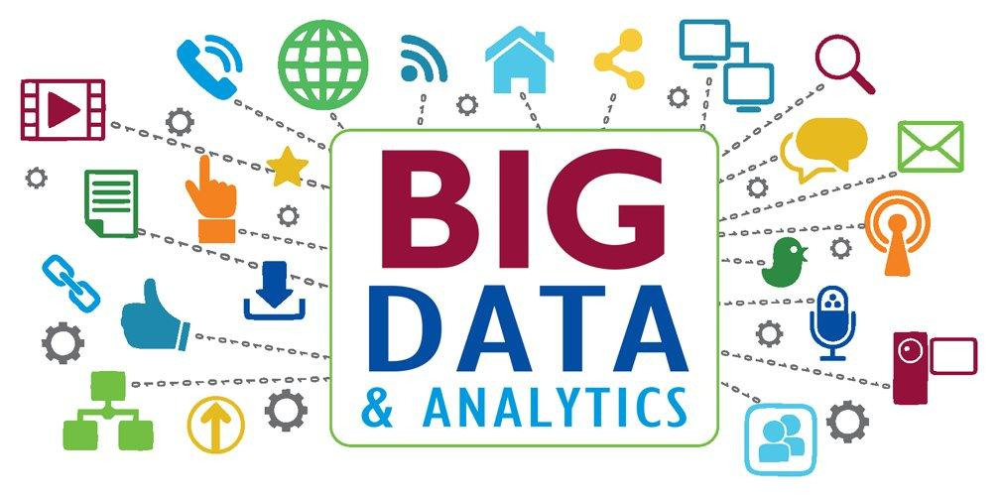
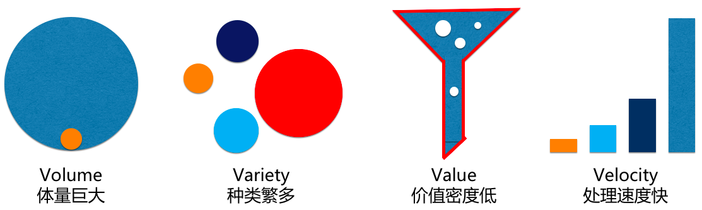
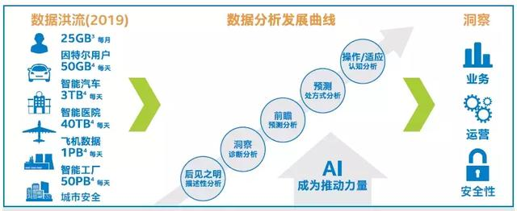
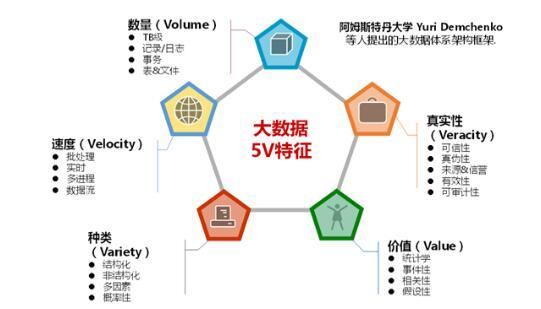
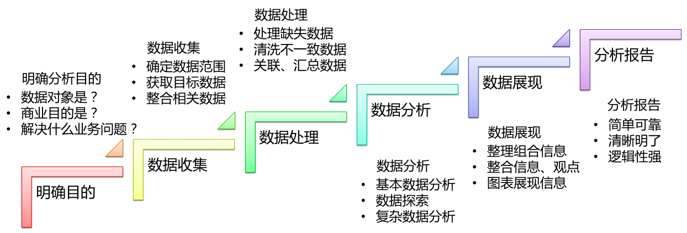
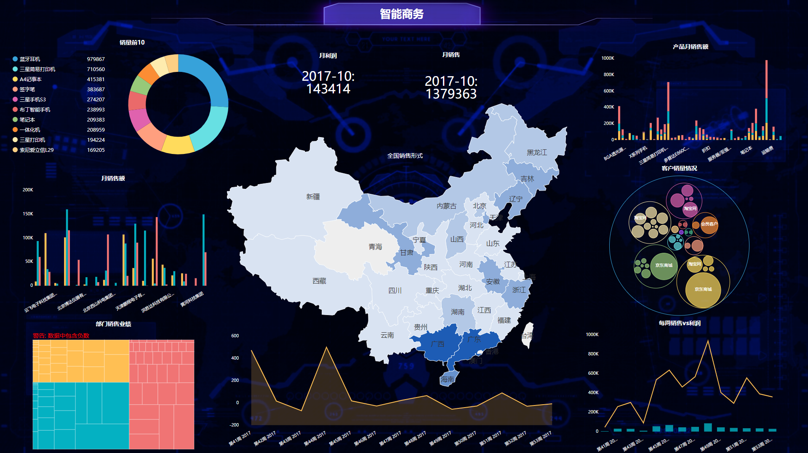
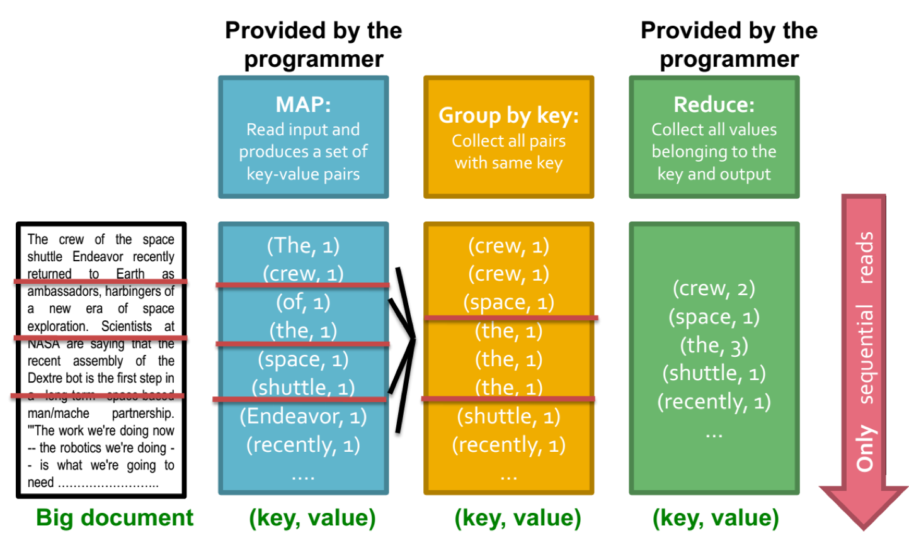
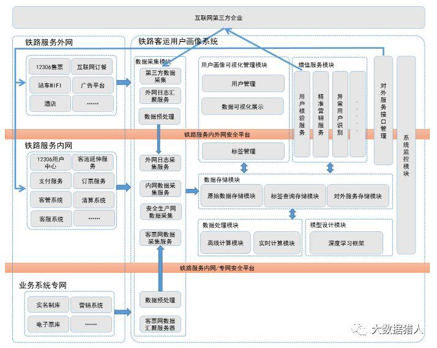

class: middle, center

### 大数据时代下人工智能技术的应用与创新

# 大数据

陈一帅

[yschen@bjtu.edu.cn](mailto:yschen@bjtu.edu.cn)

北京交通大学电子信息工程学院

.footnote[呼局中青班]

---
# 内容

- 特征
- 平台

.center[.width-80[]]

---
# 内容

- .red[特征]
- 平台

.center[.width-80[]]

---
# 背景

- 大数据时代已经到来
  - “数据，已渗透到每一行业和业务职能领域，成为重要生产因素”
  - “人们对海量数据的挖掘和运用，预示着新一波生产率增长和消费者盈余浪潮的到来”

- 海量、高增长率和多样化的信息
  - 常规软件工具无法捕捉、管理和处理
  - 需要新的处理模式

???
大数据的定义

---
class: middle, center

# 大数据特征

4V 和 5V

.center[.width-100[]]

---
# 数据量大

- 起始计量单位至少是P
  - P: 1000T
  - E: 100万T
  - Z: 10亿T

.center[.width-110[]]

---
# 数据多样

- 数据类型繁多
  - 传统格式化数据
  - 日志、音频、视频、图片、地理位置信息
- 数据有多个属性的维度
  - 如视频图像：内容，采集时间、地点、分辨率，进行图像分析后，还包括人数、天气、异常状态等属性
- 对数据处理能力提出了更高要求

---
# 数据价值密度低

- 随着物联网的广泛应用，信息感知无处不在
- 信息海量，但价值密度相对较低
- 如何通过强大的人工智能算法更迅速完成数据价值「提纯」，是大数据时代亟待解决的难题

---
# 处理速度快

- 大数据区分于传统数据挖掘最显著的特征
- 处理速度快，时效性要求高
  - 设备状态
  - 交通流量
  - 对于组织来说，投入巨大成本采集的数据，如果无法及时处理反馈有效信息，得不偿失
- 「1s定律」，也称为「秒级定律」
  - 在秒级内作出正确分析，一旦超出这个时间，数据价值就会大打折扣
  - 传统数据处理方法，无法高效处理如此海量数据

---
class: middle, center

# 大数据特征: 5V

.center[4V + 真实性 (Veracity)]

.center[.width-100[]]

<!-- .center[Volume + Velocity + Variety + Value + ] -->

---
# 数据真实

- 数据质量和管理
  - 高质量数据和有效数据管理，才能够保证分析结果的真实和价值
  - 更强调真实有价值的数据
- 挑战
  - 一些企业或个人为了达到某种目的，可能操纵和伪造数据
  - 数据来源可能过于单一
  - 这都会造成分析效果不佳

---
# 内容

- 特征
- .red[工作]
- 平台

???

内容

- 与20年前的日志处理系统几乎相同
  - 采集：日志处理分析实现日志采集
  - 存储：用文本文件或者关系数据库存储日志
  - 分析：脚本语言实现文本分析
  - 使用：通用报表系统实现展示

.center[.width-90[]]

---
# 工作

- 采集和存储
- 导入和预处理
- 统计/分析
- 挖掘

.center[.width-100[]]

---
# 采集和存储

- 数据获取
  - 从传感器和其它模拟和数字被测单元中自动采集信息
- 存储
  - 传统关系型数据库，Redis，MongoDB NoSQL数据库
  - 大数据Hadoop分布式存储
- 特点和挑战
  - 并发数高，同时上千万用户访问和操作
    - 火车票售票网站、双11购物网站，并发访问量峰值上千万
  - 需要在采集端部署大数据才能支撑：负载均衡，分片

---
# 数据导入和预处理

- 导入
  - 采集端有很多数据库
  - 将数据导入集中大型分布式数据库，或存储集群
- 预处理核心步骤
  - 清洗、转换、简化
- 特点和挑战
  - 数据量大
  - 每秒导入百兆、千兆

???
许多入门教程在导入数据时只教如何导入预处理过的数据，例如手写体数字或者电影评分数据，用一行代码就能搞定，但实际操作没那么简单。遇到实际问题，都需要先找到正确的数据集，最终预测的结论依赖于最初导入的数据。导入与预处理过程的特点和挑战主要是导入的

---
# 统计/分析

- 预设主题
  - 日常分析需求
  - 分析、分类、汇总
- 特点和挑战
  - 数据量大，对系统资源，特别是I/O有极大占用
- 分布式处理
  - 分布式数据库、集群
  - Hadoop，Storm，Spark

---
# 统计/分析

.center[可视化]

.center[.width-100[]]

---
# 挖掘

- 不预先设定主题
  - 从海量数据中发现隐含知识和规律
  - 基于数据库理论、机器学习、人工智能、现代统计学
- 典型算法
  - 聚类：Kmeans
  - 预测：SVM、NaiveBayes、线性回归
- 工具
  - Hadoop Mahout、Spark MLlib
- 特点和挑战
  - 算法复杂,计算涉及的数据量和计算量很大

???
普遍的大数据处理流程至少应该满足这以上四个点的步骤，才能算得上是一个比较完整的大数据处理过程。当然，更加深入研究大数据流程的话，还会有更多有特点的、更加深入的、更加专业的大数据分析方法。

---
# 内容

- 背景
- 价值
- 应用
- 特征
- 工作
- .red[平台]

---
# 数据中心

.center[.width-80[]]

.center[廉价机器集群，普通计算机，有限寿命 (1000天)，数量多 (Millions)
一个节点，既有计算，又有存储]

---
# 数据中心

.center[.width-100[]]

---
class: middle, center

# 安全

视频：现代数据中心7层安全

---
# Map-Reduce 计算方法

- Map
  - 将大任务分解，在集群计算机上分别计算
- Reduce
  - 组合中间结果，得到最终结果

.center[.width-70[]]

---
class: middle, center
# 功能模块

<!-- .center[决策、洞察、优化] -->

.center[.width-90[]]

---
class: middle, center
<!-- # 架构 -->

<!-- .center[决策、洞察、优化] -->

.center[.width-100[]]

---
# 小结

- 背景
- 价值：更强决策力、洞察力和流程优化力
- 应用：交通、金融、互联网
- 特征：4V，5V
- 工作：收集、清洗、分析、挖掘
- 平台：数据中心、Map-Reduce计算模型

???
- 数据先行者，《带你了解不同大数据处理框架技术特点以及适合的解决方案》，2017-09-07，[链接](https://kknews.cc/tech/gbbobb8.html)